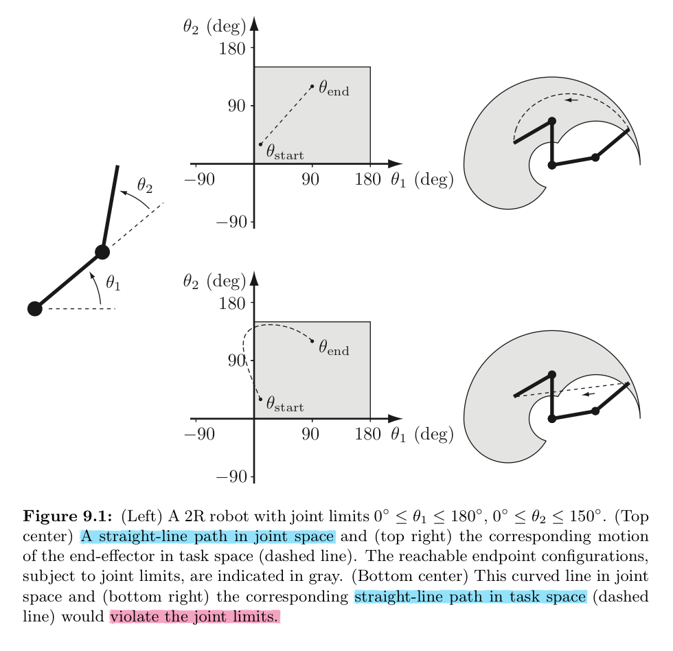

# Trajectory Generation

Trajectory $\theta(t)$: the combination of a **path** $\theta(s)$ (geometric description of the sequence of configurations achieved by the robot) and a **time scaling** $s(t)$ (specifies the times when those configurations are reached)

1. point-to-point straight-line trajectories in both joint space and task space
2. trajectories passing through a sequence of timed via points
3. minimum-time trajectories along specified paths taking actuator limits into consideration

## Point-to-point trajectories
最简单的motion是从一种位形的静止到另一个静止，这就是point-to-point motion。最简单的 ptp motion 就是直线运动。

### Straigh-line paths
直线可以从任务空间定义也可以从关节空间定义，但是关节空间的直线更通用，这是因为关节空间可以将关节限制纳入考量。由于关节位形是一个凸集，只要起止点都在该凸集内，它们之间的直线上的任意点对会在该凸集内（凸集定义），即满足关节限制。而定义在任务空间内的直线有时会违反关节限制。下图很好了证明了这一点

那么关节空间上直线的定义就是
 

如果是任务空间上的直线，因为没有天然的凸包限制，则需要注意：
- 如果路径经过靠近奇点的位置，速度会变得相当大，无论时间如何缩放；
- 由于机器人的可到达任务空间在X坐标中可能不是凸的，因此可能无法到达两个可到达端点之间直线上的某些点。

 

## Polynomial via point trajectories 

## Time-optimal time scaling

