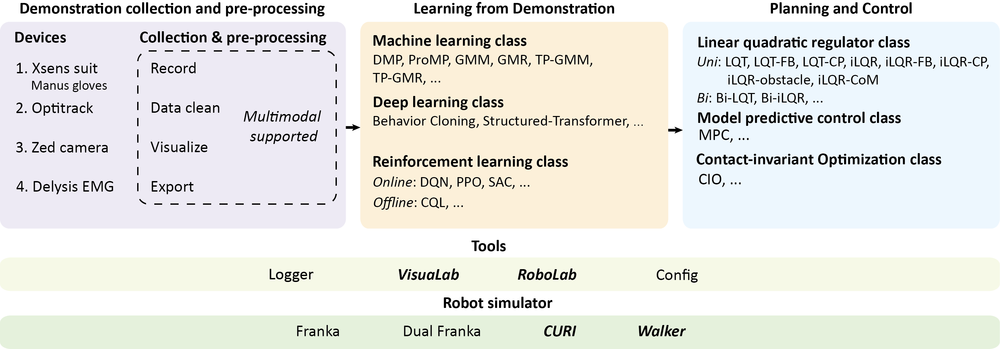

# Rofunc: The Full Process Python Package for Robot Learning from Demonstration


## Rofunc

Rofunc package focuses on the **robotic Imitation Learning (IL) and Learning from Demonstration (LfD)** fields and provides valuable and 
convenient python functions for robotics, including _demonstration collection, data pre-processing, LfD algorithms, planning, and control methods_. We also plan to provide an Isaac Gym-based robot simulator for evaluation. This package aims to advance the field by building a full-process toolkit and validation platform that simplifies and standardizes the process of demonstration data collection, processing, learning, and its deployment on robots.



### Installation
The installation is very easy,

```
pip install rofunc
```

and as you'll find later, it's easy to use as well!

```python
import rofunc as rf
```

Thus, have fun in the robotics world!

### [Documentation](./rofunc/)
Currently, we provide a simple document; please refer to [here](./rofunc/). A comprehensive one with both English and 
Chinese versions is built via the [readthedoc](https://rofunc.readthedocs.io/en/stable/). 
The available functions and plans can be found as follows.


| Classes                                         | Types                  | Functions               | Description                                                                   | Status |
|-------------------------------------------------|------------------------|-------------------------|-------------------------------------------------------------------------------|--------|
| **Demonstration collection and pre-processing** | Xsens                  | `xsens.record`          | Record the human motion via network streaming                                 |        |
|                                                 |                        | `xsens.process`         | Decode the .mvnx file                                                         | ✅      |
|                                                 |                        | `xsens.visualize`       | Show or save gif about the motion                                             | ✅      |
|                                                 | Optitrack              | `optitrack.record`      | Record the motion of markers via network streaming                            |        |
|                                                 |                        | `optitrack.process`     | Process the output .csv data                                                  | ✅      |
|                                                 |                        | `optitrack.visualize`   | Show or save gif about the motion                                             |        |
|                                                 | ZED                    | `zed.record`            | Record with multiple cameras                                                  | ✅      |
|                                                 |                        | `zed.playback`          | Playback the recording and save snapshots                                     | ✅      |
|                                                 |                        | `zed.export`            | Export the recording to mp4                                                   | ✅      |
|                                                 | Delsys EMG             | `emg.record`            | Record real-time EMG data via network streaming                               | ✅      |
|                                                 |                        | `emg.process`           | Filtering the EMG data                                                        | ✅      |
|                                                 |                        | `emg.visualize`         | Some visualization functions for EMG data                                     | ✅      |
|                                                 | Multimodal             | `mmodal.record`         | Record multi-modal demonstration data simultaneously                          |        |
|                                                 |                        | `mmodal.export`         | Export multi-modal demonstration data in one line                             | ✅      |
| **Learning from Demonstration**                 | DMP                    | `dmp.uni`               | DMP for one agent with several (or one) demonstrated trajectories             |        |
|                                                 | GMR                    | `gmr.uni`               | GMR for one agent with several (or one) demonstrated trajectories             | ✅      |
|                                                 | TP-GMM                 | `tpgmm.uni`             | TP-GMM for one agent with several (or one) demonstrated trajectories          | ✅      |
|                                                 |                        | `tpgmm.bi`              | TP-GMM for two agents with coordination learned from demonstration            | ✅      |
|                                                 | TP-GMR                 | `tpgmr.uni`             | TP-GMR for one agent with several (or one) demonstrated trajectories          | ✅      |
|                                                 |                        | `tpgmr.bi`              | TP-GMR for two agents with coordination learned from demonstration            | ✅      |
|                                                 | Behavior Cloning       | `bc.uni`                | NN-based baseline behavior cloning method                                     |        |
|                                                 | Structured-Transformer | `strans.uni`            | Structured-Transformer method propose in                                      |        |
|                                                 | CQL                    | `cql.uni`               | Conservative Q-learning for fully offline learning                            |        |
|                                                 |                        | `mcql.uni`              | Mixed conservative Q-learning for learning from demonstration with interation |        |
| **Planning**                                    | LQT                    | `lqt.uni`               | LQT for one agent with several via-points                                     | ✅      |
|                                                 |                        | `lqt.bi`                | LQT for two agents with coordination constraints                              | ✅      |
|                                                 |                        | `lqt.hierarchical`      | Generate smooth trajectories for robot execution hierarchically               | ✅      |
|                                                 |                        | `lqt.recursive`         | Generate smooth trajectories with feedback                                    |        |
|                                                 | iLQR                   | `ilqr.uni`              | Iterative LQR (iLQR) for one agent with several via-points                    |        |
|                                                 |                        | `ilqr.bi`               | Iterative LQR (iLQR) for two agents with several via-points                   |        |
| **Tools**                                       | Logger                 | `logger.write`          | Custom tensorboard-based logger                                               |        |
|                                                 | Coordinate             | `coord.custom_class`    | Define the custom class of `Pose`                                             |        |
|                                                 |                        | `coord.transform`       | Useful functions about coordinate transformation                              | ✅      |
|                                                 | VisuaLab               | `visualab.trajectory`   | 2-dim/3-dim/with ori trajectory visualization                                 | ✅      |
|                                                 |                        | `visualab.distribution` | 2-dim/3-dim distribution visualization                                        | ✅      |
|                                                 |                        | `visualab.ellipsoid`    | 2-dim/3-dim ellipsoid visualization                                           | ✅      |
|                                                 | RoboLab                | `robolab.kinematics`    | Forward /inverse kinematics w.r.t URDF file                                   |        |
| **Simulator**                                   | Franka                 | `franka.sim`            | Execute specific trajectory via single Franka Panda arm in Isaac Gym          | ✅      |
|                                                 | DualFranka             | `dualfranka.sim`        | Execute specific trajectory via dual Franka Panda arm in Isaac Gym            |        |
|                                                 | CURI                   | `curi.sim`              | Execute specific trajectory via human-like CURI robot in Isaac Gym            |        |
|                                                 | Walker                 | `walker.sim`            | Execute specific trajectory via UBTECH Walker robot  in Isaac Gym             |        |

## Roadmap

Roadmap is a personal learning experience and also simple guidance about robotics and Learning from Demonstration (LfD) fields.

