---

# Rofunc: The Full Process Python Package for Robot Learning from Demonstration and Robot Manipulation

[](https://pypi.org/project/rofunc/)

[](https://huggingface.co/jonastokoliu/Rofunc)

[](https://github.com/Skylark0924/Rofunc/issues?q=is%3Aissue+is%3Aclosed)
[](https://rofunc.readthedocs.io/en/latest/?badge=latest)
[](https://actions-badge.atrox.dev/Skylark0924/Rofunc/goto?ref=main)

> **Repository address: https://github.com/Skylark0924/Rofunc** <br>
> **Documentation: https://rofunc.readthedocs.io/**

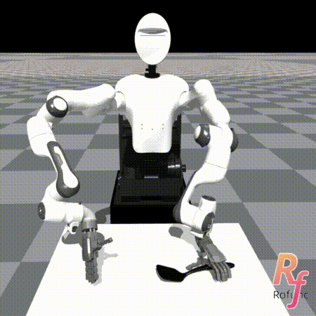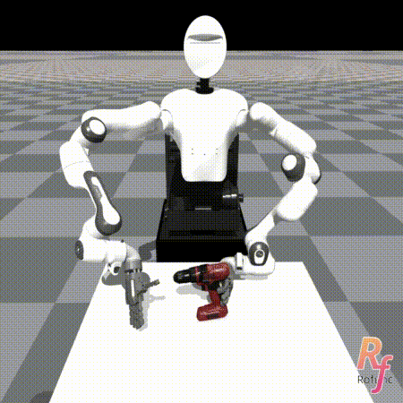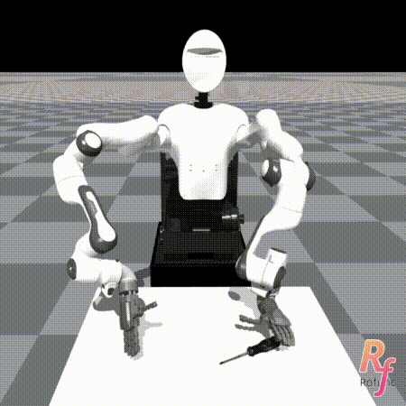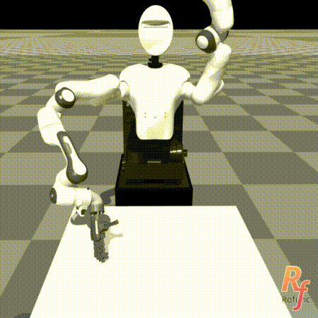

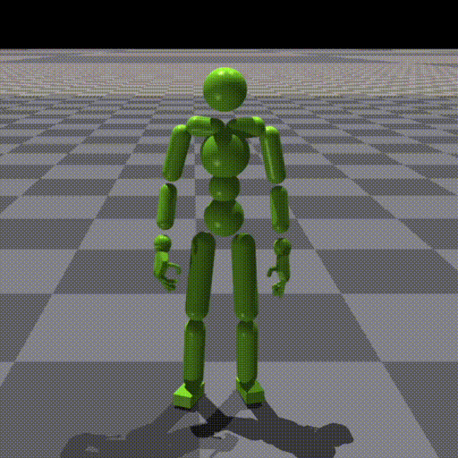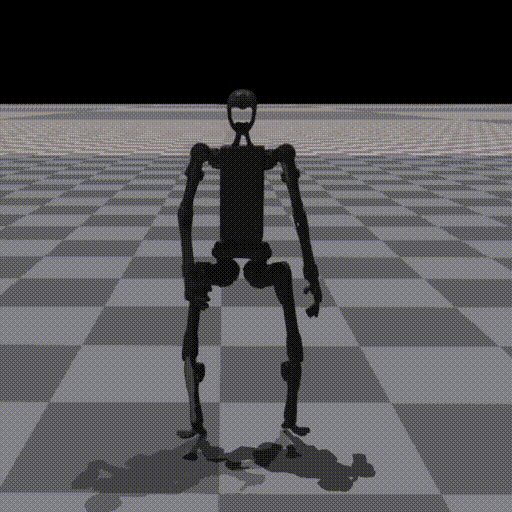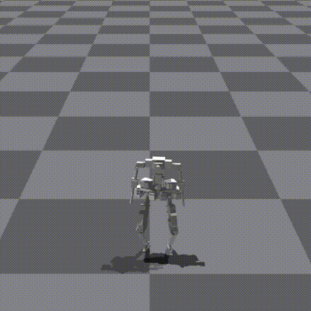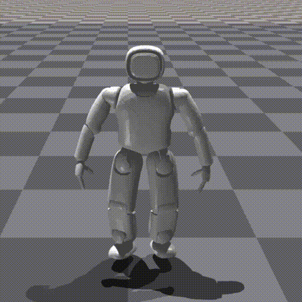


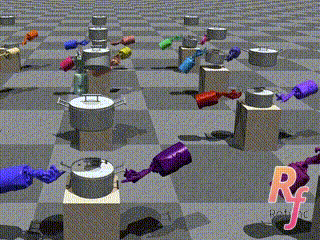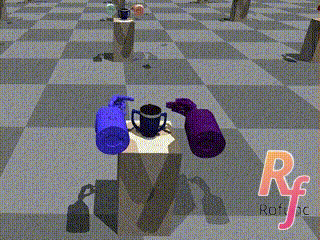


Rofunc package focuses on the **Imitation Learning (IL), Reinforcement Learning (RL) and Learning from Demonstration (LfD)** for **(Humanoid) Robot Manipulation**. It provides valuable and convenient python functions, including
_demonstration collection, data pre-processing, LfD algorithms, planning, and control methods_. We also provide an
`IsaacGym` and `OmniIsaacGym` based robot simulator for evaluation. This package aims to advance the field by building a full-process
toolkit and validation platform that simplifies and standardizes the process of demonstration data collection,
processing, learning, and its deployment on robots.

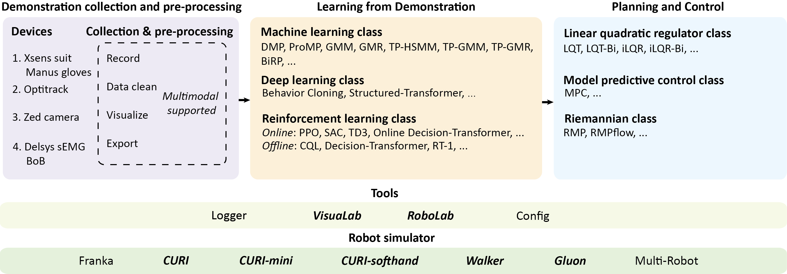

- [Rofunc: The Full Process Python Package for Robot Learning from Demonstration and Robot Manipulation](#rofunc-the-full-process-python-package-for-robot-learning-from-demonstration-and-robot-manipulation)
  - [Citation](#citation)
  - [Update News 🎉🎉🎉](#update-news-)
    - [v0.0.2.6 Support dexterous grasping and human-humanoid robot skill transfer](#v0026-support-dexterous-grasping-and-human-humanoid-robot-skill-transfer)
  - [Installation](#installation)
  - [Documentation](#documentation)
  - [RofuncRL](#rofuncrl)
  - [Star History](#star-history)
  - [Related Papers          ](#related-papers)
  - [The Team](#the-team)
  - [Acknowledge](#acknowledge)
    - [Learning from Demonstration](#learning-from-demonstration)
    - [Planning and Control](#planning-and-control)

## Citation

If you use rofunc in a scientific publication, we would appreciate citations to the following paper:

```
@article{liu2023rofunc,
	title={Rofunc: The Full Process Python Package for Robot Learning from Demonstration and Robot Manipulation},
	author={Liu, Junjia and Dong, Zhipeng and Li, Chenzui and Li, Zhihao and Yu, Minghao and Delehelle, Donatien and Chen, Fei},
	year={2023},
	journal={Zenodo, https://github.com/Skylark0924/Rofunc},
	doi={10.5281/zenodo.10016946},
}
```
> [!WARNING]
> **If our code is found to be used in a published paper without proper citation, we reserve the right to address this issue formally by contacting the editor to report potential academic misconduct!**
> 
> **如果我们的代码被发现用于已发表的论文而没有被恰当引用，我们保留通过正式联系编辑报告潜在学术不端行为的权利。**

## Update News 🎉🎉🎉

- [2024-12-24] 🎮 Start trying to support [Genesis](https://github.com/Genesis-Embodied-AI/Genesis) simulator.
### v0.0.2.6 Support dexterous grasping and human-humanoid robot skill transfer
- [2024-12-20] 🎉🚀 **Human-level skill transfer from human to heterogeneous humanoid robots have been completed and are awaiting release. [Preview](https://rofunc.readthedocs.io/en/latest/lfd/RofuncRL/HOTU.html)**
- [2024-01-24] 🚀 [CURI Synergy-based Softhand grasping tasks](https://github.com/Skylark0924/Rofunc/blob/main/examples/learning_rl/IsaacGym_RofuncRL/example_DexterousHands_RofuncRL.py) are supported to be trained by `RofuncRL`.
- **[2023-10-31] 🚀 [`RofuncRL`](https://rofunc.readthedocs.io/en/latest/lfd/RofuncRL/index.html): A modular easy-to-use Reinforcement Learning sub-package designed for Robot Learning tasks is released. It has been tested with simulators like `OpenAIGym`, `IsaacGym`, `OmniIsaacGym` (see [example gallery](https://rofunc.readthedocs.io/en/latest/examples/learning_rl/index.html)), and also differentiable simulators like `PlasticineLab` and `DiffCloth`.**
- ...
- If you want to know more about the update news, please refer to the [changelog](https://github.com/Skylark0924/Rofunc/blob/main/changelog.md).

## Installation

Please refer to the [installation guide](https://rofunc.readthedocs.io/en/latest/installation.html).

## Documentation

[](https://rofunc.readthedocs.io/en/latest/)
[](https://rofunc.readthedocs.io/en/latest/examples/index.html)

To give you a quick overview of the pipeline of `rofunc`, we provide an interesting example of learning to play Taichi
from human demonstration. You can find it in the [Quick start](https://rofunc.readthedocs.io/en/latest/quickstart.html)
section of the documentation.


<details>
<summary>The available functions and plans can be found as follows.</summary>

> **Note**
> ✅: Achieved 🔃: Reformatting ⛔: TODO

|                                                  Data                                                   |   |                                                Learning                                                |    |                                                        P&C                                                         |    |                                                        Tools                                                        |   |                                                  Simulator                                                   |    |
|:-------------------------------------------------------------------------------------------------------:|---|:------------------------------------------------------------------------------------------------------:|----|:------------------------------------------------------------------------------------------------------------------:|----|:-------------------------------------------------------------------------------------------------------------------:|---|:------------------------------------------------------------------------------------------------------------:|----|
|              [`xsens.record`](https://rofunc.readthedocs.io/en/latest/devices/xsens.html)               | ✅ |                                                 `DMP`                                                  | ⛔  |                         [`LQT`](https://rofunc.readthedocs.io/en/latest/planning/lqt.html)                         | ✅  |                                                      `config`                                                       | ✅ |                  [`Franka`](https://rofunc.readthedocs.io/en/latest/simulator/franka.html)                   | ✅  |
|              [`xsens.export`](https://rofunc.readthedocs.io/en/latest/devices/xsens.html)               | ✅ |      [`GMR`](https://rofunc.readthedocs.io/en/latest/apidocs/rofunc/rofunc.learning.ml.gmr.html)       | ✅  |       [`LQTBi`](https://rofunc.readthedocs.io/en/latest/apidocs/rofunc/rofunc.planning_control.lqt.lqt.html)       | ✅  |      [`logger`](https://rofunc.readthedocs.io/en/latest/apidocs/rofunc/rofunc.utils.logger.beauty_logger.html)      | ✅ |                    [`CURI`](https://rofunc.readthedocs.io/en/latest/simulator/curi.html)                     | ✅  |
|              [`xsens.visual`](https://rofunc.readthedocs.io/en/latest/devices/xsens.html)               | ✅ |    [`TPGMM`](https://rofunc.readthedocs.io/en/latest/apidocs/rofunc/rofunc.learning.ml.tpgmm.html)     | ✅  |                      [`LQTFb`](https://rofunc.readthedocs.io/en/latest/planning/lqt_fb.html)                       | ✅  |            [`datalab`](https://rofunc.readthedocs.io/en/latest/apidocs/rofunc/rofunc.utils.datalab.html)            | ✅ |                                                  `CURIMini`                                                  | 🔃 |
|             [`opti.record`](https://rofunc.readthedocs.io/en/latest/devices/optitrack.html)             | ✅ |   [`TPGMMBi`](https://rofunc.readthedocs.io/en/latest/apidocs/rofunc/rofunc.learning.ml.tpgmm.html)    | ✅  |                      [`LQTCP`](https://rofunc.readthedocs.io/en/latest/planning/lqt_cp.html)                       | ✅  | [`robolab.coord`](https://rofunc.readthedocs.io/en/latest/apidocs/rofunc/rofunc.utils.robolab.coord.transform.html) | ✅ |   [`CURISoftHand`](https://rofunc.readthedocs.io/en/latest/apidocs/rofunc/rofunc.simulator.curi_sim.html)    | ✅  |
|             [`opti.export`](https://rofunc.readthedocs.io/en/latest/devices/optitrack.html)             | ✅ | [`TPGMM_RPCtl`](https://rofunc.readthedocs.io/en/latest/apidocs/rofunc/rofunc.learning.ml.tpgmm.html)  | ✅  |  [`LQTCPDMP`](https://rofunc.readthedocs.io/en/latest/apidocs/rofunc/rofunc.planning_control.lqt.lqt_cp_dmp.html)  | ✅  |   [`robolab.fk`](https://rofunc.readthedocs.io/en/latest/apidocs/rofunc/rofunc.utils.robolab.kinematics.fk.html)    | ✅ |     [`Walker`](https://rofunc.readthedocs.io/en/latest/apidocs/rofunc/rofunc.simulator.walker_sim.html)      | ✅  |
|             [`opti.visual`](https://rofunc.readthedocs.io/en/latest/devices/optitrack.html)             | ✅ | [`TPGMM_RPRepr`](https://rofunc.readthedocs.io/en/latest/apidocs/rofunc/rofunc.learning.ml.tpgmm.html) | ✅  |        [`LQR`](https://rofunc.readthedocs.io/en/latest/apidocs/rofunc/rofunc.planning_control.lqr.lqr.html)        | ✅  |   [`robolab.ik`](https://rofunc.readthedocs.io/en/latest/apidocs/rofunc/rofunc.utils.robolab.kinematics.ik.html)    | ✅ |                                                   `Gluon`                                                    | 🔃 |
|                [`zed.record`](https://rofunc.readthedocs.io/en/latest/devices/zed.html)                 | ✅ |    [`TPGMR`](https://rofunc.readthedocs.io/en/latest/apidocs/rofunc/rofunc.learning.ml.tpgmr.html)     | ✅  |     [`PoGLQRBi`](https://rofunc.readthedocs.io/en/latest/apidocs/rofunc/rofunc.planning_control.lqr.lqr.html)      | ✅  |                                                    `robolab.fd`                                                     | ⛔ |                                                   `Baxter`                                                   | 🔃 |
|                [`zed.export`](https://rofunc.readthedocs.io/en/latest/devices/zed.html)                 | ✅ |   [`TPGMRBi`](https://rofunc.readthedocs.io/en/latest/apidocs/rofunc/rofunc.learning.ml.tpgmr.html)    | ✅  |                        [`iLQR`](https://rofunc.readthedocs.io/en/latest/planning/ilqr.html)                        | 🔃 |                                                    `robolab.id`                                                     | ⛔ |                                                   `Sawyer`                                                   | 🔃 |
|                [`zed.visual`](https://rofunc.readthedocs.io/en/latest/devices/zed.html)                 | ✅ |   [`TPHSMM`](https://rofunc.readthedocs.io/en/latest/apidocs/rofunc/rofunc.learning.ml.tphsmm.html)    | ✅  |    [`iLQRBi`](https://rofunc.readthedocs.io/en/latest/apidocs/rofunc/rofunc.planning_control.lqr.ilqr_bi.html)     | 🔃 |  [`visualab.dist`](https://rofunc.readthedocs.io/en/latest/apidocs/rofunc/rofunc.utils.visualab.distribution.html)  | ✅ |   [`Humanoid`](https://rofunc.readthedocs.io/en/latest/apidocs/rofunc/rofunc.simulator.humanoid_sim.html)    | ✅  |
|  [`emg.record`](https://rofunc.readthedocs.io/en/latest/apidocs/rofunc/rofunc.devices.emg.record.html)  | ✅ |         [`RLBaseLine(SKRL)`](https://rofunc.readthedocs.io/en/latest/lfd/RLBaseLine/SKRL.html)         | ✅  |                                                      `iLQRFb`                                                      | 🔃 |   [`visualab.ellip`](https://rofunc.readthedocs.io/en/latest/apidocs/rofunc/rofunc.utils.visualab.ellipsoid.html)   | ✅ | [`Multi-Robot`](https://rofunc.readthedocs.io/en/latest/apidocs/rofunc/rofunc.simulator.multirobot_sim.html) | ✅  |
|  [`emg.export`](https://rofunc.readthedocs.io/en/latest/apidocs/rofunc/rofunc.devices.emg.export.html)  | ✅ |                                          `RLBaseLine(RLlib)`                                           | ✅  |    [`iLQRCP`](https://rofunc.readthedocs.io/en/latest/apidocs/rofunc/rofunc.planning_control.lqr.ilqr_cp.html)     | 🔃 |   [`visualab.traj`](https://rofunc.readthedocs.io/en/latest/apidocs/rofunc/rofunc.utils.visualab.trajectory.html)   | ✅ |                                                                                                              |    |
|                                             `mmodal.record`                                             | ⛔ |                                          `RLBaseLine(ElegRL)`                                          | ✅  |  [`iLQRDyna`](https://rofunc.readthedocs.io/en/latest/apidocs/rofunc/rofunc.planning_control.lqr.ilqr_dyna.html)   | 🔃 |   [`oslab.dir_proc`](https://rofunc.readthedocs.io/en/latest/apidocs/rofunc/rofunc.utils.oslab.dir_process.html)    | ✅ |                                                                                                              |    |
| [`mmodal.sync`](https://rofunc.readthedocs.io/en/latest/apidocs/rofunc/rofunc.devices.mmodal.sync.html) | ✅ |                                            `BCO(RofuncIL)`                                             | 🔃 | [`iLQRObs`](https://rofunc.readthedocs.io/en/latest/apidocs/rofunc/rofunc.planning_control.lqr.ilqr_obstacle.html) | 🔃 |  [`oslab.file_proc`](https://rofunc.readthedocs.io/en/latest/apidocs/rofunc/rofunc.utils.oslab.file_process.html)   | ✅ |                                                                                                              |    |
|                                                                                                         |   |                                            `BC-Z(RofuncIL)`                                            | ⛔  |                                                       `MPC`                                                        | ⛔  |     [`oslab.internet`](https://rofunc.readthedocs.io/en/latest/apidocs/rofunc/rofunc.utils.oslab.internet.html)     | ✅ |                                                                                                              |    |
|                                                                                                         |   |                                           `STrans(RofuncIL)`                                           | ⛔  |                                                       `RMP`                                                        | ⛔  |         [`oslab.path`](https://rofunc.readthedocs.io/en/latest/apidocs/rofunc/rofunc.utils.oslab.path.html)         | ✅ |                                                                                                              |    |
|                                                                                                         |   |                                            `RT-1(RofuncIL)`                                            | ⛔  |                                                                                                                    |    |                                                                                                                     |   |                                                                                                              |    |
|                                                                                                         |   |            [`A2C(RofuncRL)`](https://rofunc.readthedocs.io/en/latest/lfd/RofuncRL/A2C.html)            | ✅  |                                                                                                                    |    |                                                                                                                     |   |                                                                                                              |    |
|                                                                                                         |   |            [`PPO(RofuncRL)`](https://rofunc.readthedocs.io/en/latest/lfd/RofuncRL/PPO.html)            | ✅  |                                                                                                                    |    |                                                                                                                     |   |                                                                                                              |    |
|                                                                                                         |   |            [`SAC(RofuncRL)`](https://rofunc.readthedocs.io/en/latest/lfd/RofuncRL/SAC.html)            | ✅  |                                                                                                                    |    |                                                                                                                     |   |                                                                                                              |    |
|                                                                                                         |   |            [`TD3(RofuncRL)`](https://rofunc.readthedocs.io/en/latest/lfd/RofuncRL/TD3.html)            | ✅  |                                                                                                                    |    |                                                                                                                     |   |                                                                                                              |    |
|                                                                                                         |   |                                            `CQL(RofuncRL)`                                             | ⛔  |                                                                                                                    |    |                                                                                                                     |   |                                                                                                              |    |
|                                                                                                         |   |                                           `TD3BC(RofuncRL)`                                            | ⛔  |                                                                                                                    |    |                                                                                                                     |   |                                                                                                              |    |
|                                                                                                         |   |         [`DTrans(RofuncRL)`](https://rofunc.readthedocs.io/en/latest/lfd/RofuncRL/DTrans.html)         | ✅  |                                                                                                                    |    |                                                                                                                     |   |                                                                                                              |    |
|                                                                                                         |   |                                            `EDAC(RofuncRL)`                                            | ⛔  |                                                                                                                    |    |                                                                                                                     |   |                                                                                                              |    |
|                                                                                                         |   |            [`AMP(RofuncRL)`](https://rofunc.readthedocs.io/en/latest/lfd/RofuncRL/AMP.html)            | ✅  |                                                                                                                    |    |                                                                                                                     |   |                                                                                                              |    |
|                                                                                                         |   |            [`ASE(RofuncRL)`](https://rofunc.readthedocs.io/en/latest/lfd/RofuncRL/ASE.html)            | ✅  |                                                                                                                    |    |                                                                                                                     |   |                                                                                                              |    |
|                                                                                                         |   |                                          `ODTrans(RofuncRL)`                                           | ⛔  |                                                                                                                    |    |                                                                                                                     |   |                                                                                                              |    |
</details>

## RofuncRL

`RofuncRL` is one of the most important sub-packages of `Rofunc`. It is a modular easy-to-use Reinforcement Learning sub-package designed for Robot Learning tasks. It has been tested with simulators like `OpenAIGym`, `IsaacGym`, `OmniIsaacGym` (see [example gallery](https://rofunc.readthedocs.io/en/latest/examples/learning_rl/index.html)), and also differentiable simulators like `PlasticineLab` and `DiffCloth`. Here is a list of robot tasks trained by `RofuncRL`:


> **Note**\
> You can customize your own project based on RofuncRL by following the [**RofuncRL customize tutorial**](https://rofunc.readthedocs.io/en/latest/tutorial/customizeRL.html).\
> We also provide a [**RofuncRL-based repository template**](https://github.com/Skylark0924/RofuncRL-template) to generate your own repository following the RofuncRL structure by one click.\
> For more details, please check [**the documentation for RofuncRL**](https://rofunc.readthedocs.io/en/latest/examples/learning_rl/index.html).

<details>
<summary>The list of all supported tasks.</summary>

| Tasks                               | Animation                                                                                                                                                                                                                                                                                                                                                                                                                                                                                                                                                                                                                                                                                                                                                   | Performance | [ModelZoo](https://github.com/Skylark0924/Rofunc/blob/main/rofunc/config/learning/model_zoo.json) |
|-------------------------------------|-------------------------------------------------------------------------------------------------------------------------------------------------------------------------------------------------------------------------------------------------------------------------------------------------------------------------------------------------------------------------------------------------------------------------------------------------------------------------------------------------------------------------------------------------------------------------------------------------------------------------------------------------------------------------------------------------------------------------------------------------------------|-------------|---------------------------------------------------------------------------------------------------|
| Ant                                 | 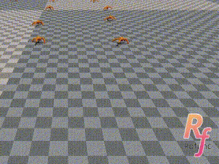                                                                                                                                                                                                                                                                                                                                                                                                                                                                                                                                                                                                                                                                                                                   |             | ✅                                                                                                 |
| Cartpole                            |                                                                                                                                                                                                                                                                                                                                                                                                                                                                                                                                                                                                                                                                                                                                                             |             |                                                                                                   |
| Franka<br/>Cabinet                  | 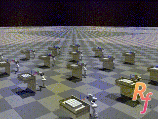                                                                                                                                                                                                                                                                                                                                                                                                                                                                                                                                                                                                                                                                                                         |             | ✅                                                                                                 |
| Franka<br/>CubeStack                |                                                                                                                                                                                                                                                                                                                                                                                                                                                                                                                                                                                                                                                                                                                                                             |             |                                                                                                   |
| CURI<br/>Cabinet                    | 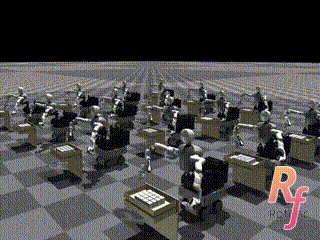                                                                                                                                                                                                                                                                                                                                                                                                                                                                                                                                                                                                                                                                                                           |             | ✅                                                                                                 |
| CURI<br/>CabinetImage               |                                                                                                                                                                                                                                                                                                                                                                                                                                                                                                                                                                                                                                                                                                            |             |                                                                                                   |
| CURI<br/>CabinetBimanual            |                                                                                                                                                                                                                                                                                                                                                                                                                                                                                                                                                                                                                                                                                                                                                             |             |                                                                                                   |
| CURIQbSoftHand<br/>SynergyGrasp     | 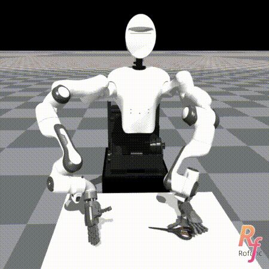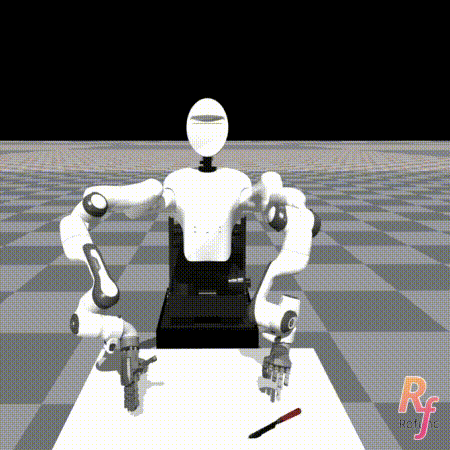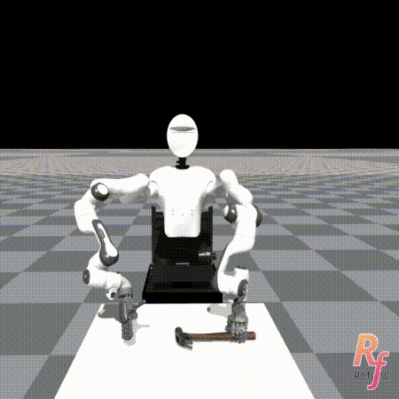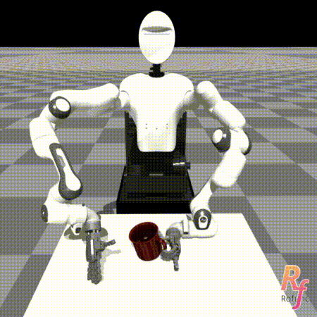 |             | ✅                                                                                                 |
| Humanoid                            | 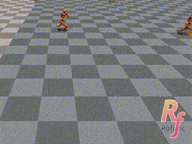                                                                                                                                                                                                                                                                                                                                                                                                                                                                                                                                                                                                                                                                                                              |             | ✅                                                                                                 |
| HumanoidAMP<br/>Backflip            |                                                                                                                                                                                                                                                                                                                                                                                                                                                                                                                                                                                                                                                                                                           |             | ✅                                                                                                 |
| HumanoidAMP<br/>Walk                |                                                                                                                                                                                                                                                                                                                                                                                                                                                                                                                                                                                                                                                                                                                                                             |             | ✅                                                                                                 |
| HumanoidAMP<br/>Run                 |                                                                                                                                                                                                                                                                                                                                                                                                                                                                                                                                                                                                                                                                                                            |             | ✅                                                                                                 |
| HumanoidAMP<br/>Dance               |                                                                                                                                                                                                                                                                                                                                                                                                                                                                                                                                                                                                                                                                                                          |             | ✅                                                                                                 |
| HumanoidAMP<br/>Hop                 |                                                                                                                                                                                                                                                                                                                                                                                                                                                                                                                                                                                                                                                                                                            |             | ✅                                                                                                 |
| HumanoidASE<br/>GetupSwordShield    |                                                                                                                                                                                                                                                                                                                                                                                                                                                                                                                                                                                                                                                                                            |             | ✅                                                                                                 |
| HumanoidASE<br/>PerturbSwordShield  |                                                                                                                                                                                                                                                                                                                                                                                                                                                                                                                                                                                                                                                                                          |             | ✅                                                                                                 |
| HumanoidASE<br/>HeadingSwordShield  |                                                                                                                                                                                                                                                                                                                                                                                                                                                                                                                                                                                                                                                                                          |             | ✅                                                                                                 |
| HumanoidASE<br/>LocationSwordShield |                                                                                                                                                                                                                                                                                                                                                                                                                                                                                                                                                                                                                                                                                         |             | ✅                                                                                                 |
| HumanoidASE<br/>ReachSwordShield    |                                                                                                                                                                                                                                                                                                                                                                                                                                                                                                                                                                                                                                                                                                                                                             |             | ✅                                                                                                 |
| HumanoidASE<br/>StrikeSwordShield   |                                                                                                                                                                                                                                                                                                                                                                                                                                                                                                                                                                                                                                                                                           |             | ✅                                                                                                 |
| BiShadowHand<br/>BlockStack         | 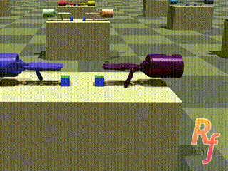                                                                                                                                                                                                                                                                                                                                                                                                                                                                                                                                                                                                                                                                                                |             | ✅                                                                                                 |
| BiShadowHand<br/>BottleCap          | 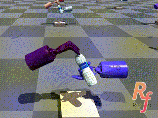                                                                                                                                                                                                                                                                                                                                                                                                                                                                                                                                                                                                                                                                                                 |             | ✅                                                                                                 |
| BiShadowHand<br/>CatchAbreast       | 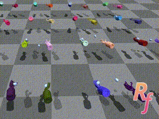                                                                                                                                                                                                                                                                                                                                                                                                                                                                                                                                                                                                                                                                                              |             | ✅                                                                                                 |
| BiShadowHand<br/>CatchOver2Underarm | 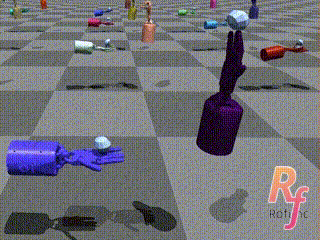                                                                                                                                                                                                                                                                                                                                                                                                                                                                                                                                                                                                                                                                                        |             | ✅                                                                                                 |
| BiShadowHand<br/>CatchUnderarm      | 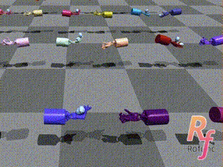                                                                                                                                                                                                                                                                                                                                                                                                                                                                                                                                                                                                                                                                                             |             | ✅                                                                                                 |
| BiShadowHand<br/>DoorOpenInward     | 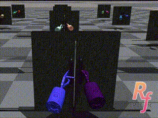                                                                                                                                                                                                                                                                                                                                                                                                                                                                                                                                                                                                                                                                                            |             | ✅                                                                                                 |
| BiShadowHand<br/>DoorOpenOutward    |                                                                                                                                                                                                                                                                                                                                                                                                                                                                                                                                                                                                                                                                                            |             | ✅                                                                                                 |
| BiShadowHand<br/>DoorCloseInward    | 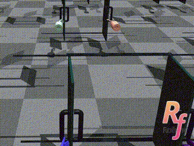                                                                                                                                                                                                                                                                                                                                                                                                                                                                                                                                                                                                                                                                                           |             | ✅                                                                                                 |
| BiShadowHand<br/>DoorCloseOutward   | 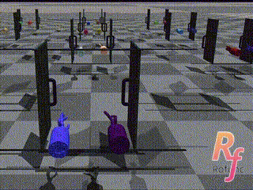                                                                                                                                                                                                                                                                                                                                                                                                                                                                                                                                                                                                                                                                                          |             | ✅                                                                                                 |
| BiShadowHand<br/>GraspAndPlace      | 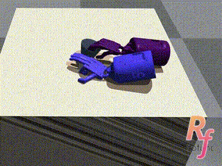                                                                                                                                                                                                                                                                                                                                                                                                                                                                                                                                                                                                                                                                                             |             | ✅                                                                                                 |
| BiShadowHand<br/>LiftUnderarm       |                                                                                                                                                                                                                                                                                                                                                                                                                                                                                                                                                                                                                                                                                               |             | ✅                                                                                                 |
| BiShadowHand<br/>HandOver           | 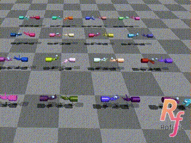                                                                                                                                                                                                                                                                                                                                                                                                                                                                                                                                                                                                                                                                                                      |             | ✅                                                                                                 |
| BiShadowHand<br/>Pen                | 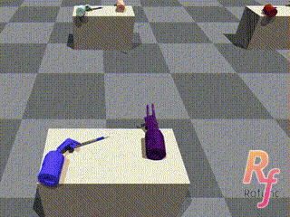                                                                                                                                                                                                                                                                                                                                                                                                                                                                                                                                                                                                                                                                                                       |             | ✅                                                                                                 |
| BiShadowHand<br/>PointCloud         |                                                                                                                                                                                                                                                                                                                                                                                                                                                                                                                                                                                                                                                                                                                                                             |             |                                                                                                   |
| BiShadowHand<br/>PushBlock          | 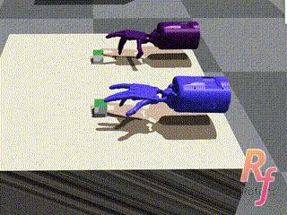                                                                                                                                                                                                                                                                                                                                                                                                                                                                                                                                                                                                                                                                                                 |             | ✅                                                                                                 |
| BiShadowHand<br/>ReOrientation      | 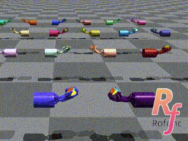                                                                                                                                                                                                                                                                                                                                                                                                                                                                                                                                                                                                                                                                                             |             | ✅                                                                                                 |
| BiShadowHand<br/>Scissors           | 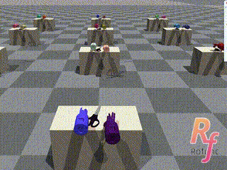                                                                                                                                                                                                                                                                                                                                                                                                                                                                                                                                                                                                                                                                                                  |             | ✅                                                                                                 |
| BiShadowHand<br/>SwingCup           |                                                                                                                                                                                                                                                                                                                                                                                                                                                                                                                                                                                                                                                                                                   |             | ✅                                                                                                 |
| BiShadowHand<br/>Switch             | 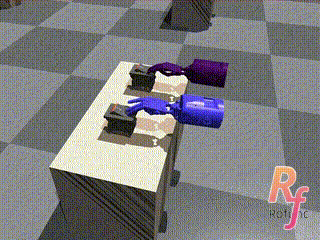                                                                                                                                                                                                                                                                                                                                                                                                                                                                                                                                                                                                                                                                                                    |             | ✅                                                                                                 |
| BiShadowHand<br/>TwoCatchUnderarm   | 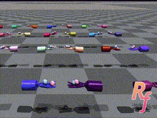                                                                                                                                                                                                                                                                                                                                                                                                                                                                                                                                                                                                                                                                                          |             | ✅                                                                                                 |

</details>

## Star History

[](https://star-history.com/#Skylark0924/Rofunc&Date)


## Related Papers          

1. Robot cooking with stir-fry: Bimanual non-prehensile manipulation of semi-fluid objects ([IEEE RA-L 2022](https://arxiv.org/abs/2205.05960) | [Code](rofunc/learning/RofuncIL/structured_transformer/strans.py))

```
@article{liu2022robot,
         title={Robot cooking with stir-fry: Bimanual non-prehensile manipulation of semi-fluid objects},
         author={Liu, Junjia and Chen, Yiting and Dong, Zhipeng and Wang, Shixiong and Calinon, Sylvain and Li, Miao and Chen, Fei},
         journal={IEEE Robotics and Automation Letters},
         volume={7},
         number={2},
         pages={5159--5166},
         year={2022},
         publisher={IEEE}
}
```

2. SoftGPT: Learn Goal-oriented Soft Object Manipulation Skills by Generative Pre-trained Heterogeneous Graph
   Transformer ([IROS 2023](https://arxiv.org/abs/2306.12677)｜Code coming soon)

```
@inproceedings{liu2023softgpt,
               title={Softgpt: Learn goal-oriented soft object manipulation skills by generative pre-trained heterogeneous graph transformer},
               author={Liu, Junjia and Li, Zhihao and Lin, Wanyu and Calinon, Sylvain and Tan, Kay Chen and Chen, Fei},
               booktitle={2023 IEEE/RSJ International Conference on Intelligent Robots and Systems (IROS)},
               pages={4920--4925},
               year={2023},
               organization={IEEE}
}
```

3. BiRP: Learning Robot Generalized Bimanual Coordination using Relative Parameterization Method on Human
   Demonstration ([IEEE CDC 2023](https://arxiv.org/abs/2307.05933) | [Code](rofunc/learning/RofuncML/tpgmm.py))

```
@inproceedings{liu2023birp,
               title={Birp: Learning robot generalized bimanual coordination using relative parameterization method on human demonstration},
               author={Liu, Junjia and Sim, Hengyi and Li, Chenzui and Tan, Kay Chen and Chen, Fei},
               booktitle={2023 62nd IEEE Conference on Decision and Control (CDC)},
               pages={8300--8305},
               year={2023},
               organization={IEEE}
}
```

## The Team

Rofunc is developed and maintained by
the [CLOVER Lab (Collaborative and Versatile Robots Laboratory)](https://feichenlab.com/), CUHK.

## Acknowledge

We would like to acknowledge the following projects:

### Learning from Demonstration

1. [pbdlib](https://gitlab.idiap.ch/rli/pbdlib-python)
2. [Ray RLlib](https://docs.ray.io/en/latest/rllib/index.html)
3. [ElegantRL](https://github.com/AI4Finance-Foundation/ElegantRL)
4. [SKRL](https://github.com/Toni-SM/skrl)
5. [DexterousHands](https://github.com/PKU-MARL/DexterousHands)

### Planning and Control

1. [Robotics codes from scratch (RCFS)](https://gitlab.idiap.ch/rli/robotics-codes-from-scratch)
