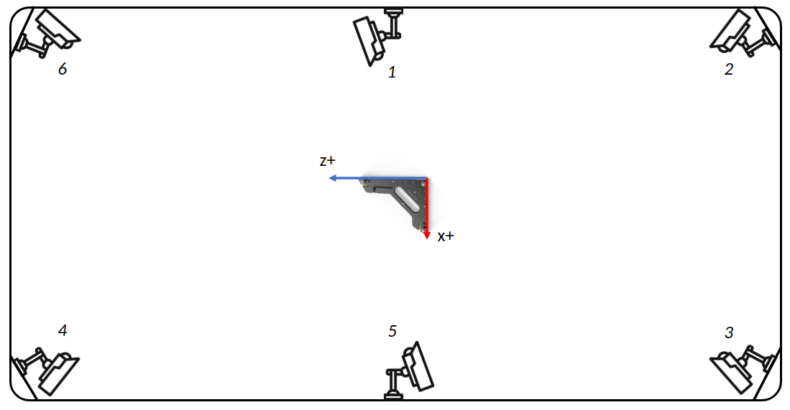

# Optitrack

- [Optitrack](#optitrack)
  - [Setup](#setup)
  - [Get useful data](#get-useful-data)
  - [Visualize the motion data](#visualize-the-motion-data)


## Setup




## Get useful data

You need first prepare your raw data in the following structure.

```
├── dough_01
│   ├── Take 2022-06-24 07.40.52 PM.csv
│   ├── Take 2022-06-24 07.40.52 PM_ManusVRGlove_3f6ec26f_3f6ec26f.csv (if applicable)
│   └── Take 2022-06-24 07.40.52 PM_ManusVRGlove_7b28f20b_7b28f20b.csv (if applicable)
├── dough_02
│   ├── Take 2022-06-24 07.44.15 PM.csv
│   ├── Take 2022-06-24 07.44.15 PM_ManusVRGlove_3f6ec26f_3f6ec26f.csv (if applicable)
│   └── Take 2022-06-24 07.44.15 PM_ManusVRGlove_7b28f20b_7b28f20b.csv (if applicable)
├── dough_03
...
```

You can get the useful data by `data_clean(input_path)`

```python
import rofunc as rf

root_path = '[your_path]/opti_data/dough_01'
rf.optitrack.data_clean(root_path)
```

Then you will obtain new csv files in the same directory.

```
├── dough_01
│   ├── left_manus.csv
│   ├── opti_hands.csv
│   ├── process
│   │   ├── Take 2022-06-24 07.40.52 PM_ManusVRGlove_3f6ec26f_3f6ec26f.csv
│   │   └── Take 2022-06-24 07.40.52 PM_ManusVRGlove_7b28f20b_7b28f20b.csv
│   ├── right_manus.csv
│   ├── Take 2022-06-24 07.40.52 PM.csv
│   ├── Take 2022-06-24 07.40.52 PM_ManusVRGlove_3f6ec26f_3f6ec26f.csv
│   └── Take 2022-06-24 07.40.52 PM_ManusVRGlove_7b28f20b_7b28f20b.csv
├── dough_02
│   ├── left_manus.csv
│   ├── opti_hands.csv
│   ├── process
│   │   ├── Take 2022-06-24 07.44.15 PM_ManusVRGlove_3f6ec26f_3f6ec26f.csv
│   │   └── Take 2022-06-24 07.44.15 PM_ManusVRGlove_7b28f20b_7b28f20b.csv
│   ├── right_manus.csv
│   ├── Take 2022-06-24 07.44.15 PM.csv
│   ├── Take 2022-06-24 07.44.15 PM_ManusVRGlove_3f6ec26f_3f6ec26f.csv
│   └── Take 2022-06-24 07.44.15 PM_ManusVRGlove_7b28f20b_7b28f20b.csv
├── dough_03
...
```

> We also provide a batch form cleaning several data in parallel.

```python 
import rofunc as rf

input_dir = '[your_path]/opti_data/'
rf.optitrack.process.data_clean_batch(input_dir)
```

## Visualize the motion data