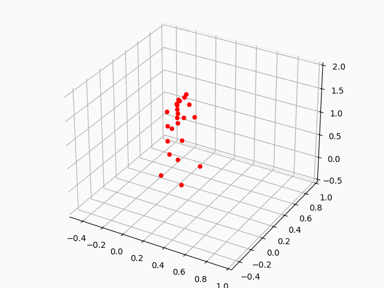

# Xsens

- [Xsens](#xsens)
  - [Setup](#setup)
  - [Convert mvnx file to npys](#convert-mvnx-file-to-npys)
  - [Visualize the motion data](#visualize-the-motion-data)


## Setup

## Convert mvnx file to npys

`get_skeleton(mvnx_path, output_dir=None)`

```python
import rofunc as rf

mvnx_file = '[your_path]/xsens_data/test.mvnx'
rf.xsens.export(mvnx_file)
```

Then you will get a folder with multiple .npy files, each one refers to one segment.

> We also provide a batch form for converting mvnx files in parallel.

```python
import rofunc as rf

mvnx_dir = '[your_path]/xsens_data'
rf.xsens.export_batch(mvnx_dir)
```

## Visualize the motion data

After obtains data of each segment, we can get a whole-body visualization
by `plot_skeleton(skeleton_data_path: str, save_gif=False)`

```python
import rofunc as rf

# `test` must be a folder with multiple .npy files about the 
# skeleton which can be generated by `export` and `export_batch`
skeleton_data_path = '[your_path]/xsens_data/test'
rf.xsens.plot_skeleton(skeleton_data_path)
```



> We also provide a batch form for saving gifs of several skeleton data in parallel.

```python
import rofunc as rf

# There must contain a folder with multiple .npy files about the skeleton which can be generated by `get_skeleton`
skeleton_dir = '[your_path]/xsens_data/'
rf.xsens.plot_skeleton_batch(skeleton_dir)
```