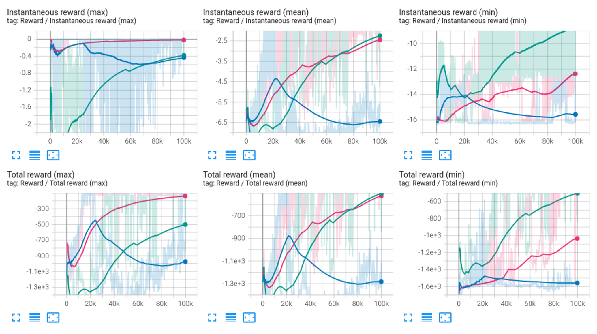

# RofuncRL A2C (Advantage Actor-Critic)


## Algorithm 

```{literalinclude} ../../../../rofunc/learning/rl/agents/online/a2c_agent.py
:pyobject: A2CAgent.update_net
```

## Performance comparison

We compare the performance of the A2C algorithm with different tricks and an open source baseline 
([SKRL](https://github.com/Toni-SM/skrl/tree/main)). These experiments were conducted on the `Pendulum-v1` environment.
The results are shown below:

### CURICabinet

- `Dark Blue`: SKRL A2C
- `Green`: Rofunc A2C with SKRL policy and value network
- `Pink`: Rofunc A2C with self-defined policy and value network
