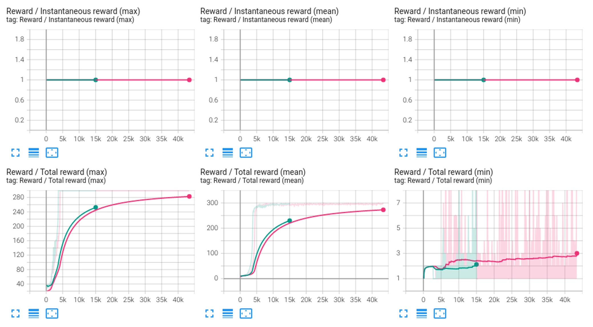

# RofuncRL AMP (Adversarial Motion Priors)


## Algorithm 

```{literalinclude} ../../../../rofunc/learning/RofuncRL/agents/online/amp_agent.py
:pyobject: AMPAgent.update_net
```

## Performance comparison

We compare the performance of the AMP algorithm with different tricks and an open source baseline 
([SKRL](https://github.com/Toni-SM/skrl/tree/main)). These experiments were conducted on the `Humanoid` environment.
The results are shown below:

### Humanoid

- `Pink`: SKRL AMP
- `Green`: Rofunc AMP 


