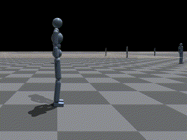
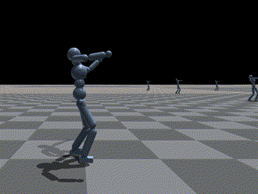

# RofuncRL AMP (Adversarial Motion Priors)


**Paper:** “AMP: Adversarial Motion Priors for Stylized Physics-Based Character Control”. Peng et al. 2021. https://arxiv.org/abs/2104.02180

## Algorithm 


AMP is a *mixline (mixed online and offline) method* that combines imitation learning and reinforcement learning, it is achieved by combining two-part reward functions $r^G$ and $r^S$:

$$
r\left(\mathrm{~s}_t, \mathrm{a}_t, \mathrm{~s}_{t+1}, \mathrm{~g}\right)=w^G r^G\left(\mathrm{~s}_t, \mathrm{a}_t, \mathrm{~s}_{t+1}, \mathrm{~g}\right)+w^S r^S\left(\mathrm{~s}_t, \mathrm{~s}_{t+1}\right)
$$

where $r^G\left(\mathrm{~s}_t, \mathrm{a}_t, \mathrm{~s}_t, \mathrm{~g}\right)$ is the `task-specific` reinforcement learning reward which defines high-level objectives $g$ that a character should satisfy (e.g. moving to a target location), $r^S\left(\mathrm{~s}_t, \mathrm{~s}_{t+1}\right)$ is the `task-agnostic` imitation learning reward which specifies low-level details of the behaviors that the character should adopt when performing the task (e.g., walking vs. running to a target). $w^G$ and $w^S$ are the weights of the two reward functions.

```python
rewards = self.memory.get_tensor_by_name("rewards")
amp_states = self.memory.get_tensor_by_name("amp_states")

with torch.no_grad():
    amp_logits = self.discriminator(self._amp_state_preprocessor(amp_states))
    if self._least_square_discriminator:
        style_reward = torch.maximum(torch.tensor(1 - 0.25 * torch.square(1 - amp_logits)),
                                        torch.tensor(0.0001, device=self.device))
    else:
        style_reward = -torch.log(torch.maximum(torch.tensor(1 - 1 / (1 + torch.exp(-amp_logits))),
                                                torch.tensor(0.0001, device=self.device)))
    style_reward *= self._discriminator_reward_scale

    combined_rewards = self._task_reward_weight * rewards + self._style_reward_weight * style_reward
```

## Demos

### Humanoid Run



```shell
python examples/learning_rl/IsaacGym_RofuncRL/example_HumanoidAMP_RofuncRL.py --task HumanoidAMP_run --inference
```

### Humanoid BackFlip


```shell
python examples/learning_rl/IsaacGym_RofuncRL/example_HumanoidAMP_RofuncRL.py --task HumanoidAMP_backflip --inference
```

### Humanoid Dance



```shell
python examples/learning_rl/IsaacGym_RofuncRL/example_HumanoidAMP_RofuncRL.py --task HumanoidAMP_dance --inference
```

### Humanoid Hop


```shell
python examples/learning_rl/IsaacGym_RofuncRL/example_HumanoidAMP_RofuncRL.py --task HumanoidAMP_hop --inference
```

## Baseline comparison

We compare the performance of the AMP algorithm with different tricks and an open source baseline 
([SKRL](https://github.com/Toni-SM/skrl/tree/main)). These experiments were conducted on the `Humanoid` environment.
The results are shown below:

### Humanoid Run

- `Pink`: SKRL AMP
- `Green`: Rofunc AMP 

### Humanoid BackFlip

- `Pink`: Rofunc AMP


## Tricks

### Least-squares discriminator

The standard GAN objective typically uses a sigmoid cross-entropy loss function. 

$$
\underset{D}{\arg \min }-\mathbb{E}_{d^{\mathcal{M}}\left(\mathrm{s}, \mathrm{s}^{\prime}\right)}\left[\log \left(D\left(\mathrm{~s}, \mathrm{~s}^{\prime}\right)\right)\right]-\mathbb{E}_{d^\pi\left(\mathrm{s}, \mathrm{s}^{\prime}\right)}\left[\log \left(1-D\left(\mathrm{~s}, \mathrm{~s}^{\prime}\right)\right)\right]
$$

However, this loss tends to lead to optimization challenges due to vanishing gradients as the sigmoid function saturates, which can hamper training of the policy. To address this issue, AMP adopts the loss function proposed for least-squares GAN (LSGAN) which is given by:

$$
\underset{D}{\arg \min } \mathbb{E}_{d^{\mathcal{M}}\left(\mathrm{s}, \mathrm{s}^{\prime}\right)}\left[\left(D\left(\mathrm{~s}, \mathrm{~s}^{\prime}\right)-1\right)^2\right]+\mathbb{E}_{d^\pi\left(\mathrm{s}, \mathrm{s}^{\prime}\right)}\left[\left(D\left(\mathrm{~s}, \mathrm{~s}^{\prime}\right)+1\right)^2\right]
$$

The discriminator is trained by solving a least-squares regression problem to predict a score of 1 for samples from the dataset and −1 for samples recorded from the policy.

```python
# discriminator prediction loss
if self._least_square_discriminator:
    discriminator_loss = 0.5 * (
                F.mse_loss(amp_cat_logits, -torch.ones_like(amp_cat_logits), reduction='mean') \
                + F.mse_loss(amp_motion_logits, torch.ones_like(amp_motion_logits), reduction='mean'))
else:
    discriminator_loss = 0.5 * (nn.BCEWithLogitsLoss()(amp_cat_logits, torch.zeros_like(amp_cat_logits)) \
                                + nn.BCEWithLogitsLoss()(amp_motion_logits,
                                                            torch.ones_like(amp_motion_logits)))
```


Compare the performance of AMP with different discriminator loss functions in `HumanoidAMP_Dance` task.
- `Red`: Rofunc AMP with standard discriminator
- `Green`: Rofunc AMP with least-squares discriminator


Compare the performance of AMP with different discriminator loss functions in `HumanoidAMP_Walk` task.
- `Light blue`: Rofunc AMP with standard discriminator
- `Pink`: Rofunc AMP with least-squares discriminator

:::{attention}
Least-squares discriminator is a stable trick used in the original AMP paper, but it seems not necessary.
:::


### Gradient penalty


```python
amp_motion_gradient = torch.autograd.grad(amp_motion_logits,
                                          sampled_amp_motion_states,
                                          grad_outputs=torch.ones_like(amp_motion_logits),
                                          create_graph=True,
                                          retain_graph=True,
                                          only_inputs=True)
gradient_penalty = torch.sum(torch.square(amp_motion_gradient[0]), dim=-1).mean()
discriminator_loss += self._discriminator_gradient_penalty_scale * gradient_penalty
```


## Network update function

```{literalinclude} ../../../../rofunc/learning/RofuncRL/agents/mixline/amp_agent.py
:pyobject: AMPAgent.update_net
```