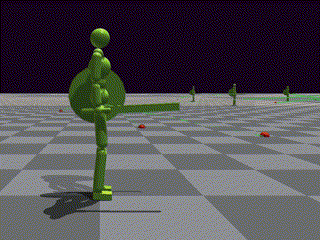

# RofuncRL ASE (Adversarial Skill Embeddings)

**Paper:** “ASE: Large-Scale Reusable Adversarial Skill Embeddings for Physically Simulated Characters”. Peng et al. 2022. https://arxiv.org/abs/2205.01906

## Algorithm


## Demos

### Pre-trained latent space model


```shell
python examples/learning_rl/IsaacGym_RofuncRL/example_HumanoidASE_RofuncRL.py --task HumanoidASEGetupSwordShield --motion_file reallusion_sword_shield/dataset_reallusion_sword_shield.yaml --inference
```

### Pre-trained latent space model with perturbation

You can test the robustness of the latent space model by changing to `HumanoidASEPerturbSwordShield` task (throwing
boxes to the humanoid robot). It will use **the same pre-trained latent space model as previous demo**, but set
the `reset` function to reset by the maximum length of the episode, rather than resetting immediately when robots fall
on the ground.


```shell
python examples/learning_rl/IsaacGym_RofuncRL/example_HumanoidASE_RofuncRL.py --task HumanoidASEPerturbSwordShield --motion_file reallusion_sword_shield/dataset_reallusion_sword_shield.yaml --inference
```

> **Note**
> By using the pre-trained latent space model, we can train some high-level policies for complex tasks with simple
> task-specific reward functions.

### High-level policy learning with pre-trained latent space model (Heading)

`HumanoidASEHeadingSwordShield` task: the humanoid robot should face to the blue line and walk towards the red line.


```shell
python examples/learning_rl/IsaacGym_RofuncRL/example_HumanoidASE_RofuncRL.py --task HumanoidASEHeadingSwordShield --motion_file reallusion_sword_shield/RL_Avatar_Idle_Ready_Motion.npy --inference
```

### High-level policy learning with pre-trained latent space model (Location)

`HumanoidASELocationSwordShield` task: the humanoid robot should walk to the red location.




```shell
python examples/learning_rl/IsaacGym_RofuncRL/example_HumanoidASE_RofuncRL.py --task HumanoidASELocationSwordShield --motion_file reallusion_sword_shield/RL_Avatar_Idle_Ready_Motion.npy --inference
```

### High-level policy learning with pre-trained latent space model (Reach)

`HumanoidASEReachSwordShield` task: the humanoid robot should let the sword reach the red point.

```shell
python examples/learning_rl/IsaacGym_RofuncRL/example_HumanoidASE_RofuncRL.py --task HumanoidASEReachSwordShield --motion_file reallusion_sword_shield/RL_Avatar_Idle_Ready_Motion.npy --inference
```

### High-level policy learning with pre-trained latent space model (Strike)

`HumanoidASEStrikeSwordShield` task: the humanoid robot should strike the sword to the block.


```shell
python examples/learning_rl/IsaacGym_RofuncRL/example_HumanoidASE_RofuncRL.py --task HumanoidASEStrikeSwordShield --motion_file reallusion_sword_shield/RL_Avatar_Idle_Ready_Motion.npy --inference
```

### Motion visualization

If you want to visualize the motion, you can use `HumanoidViewMotion` task. For example, you can use the following
command to visualize the motion `reallusion_sword_shield/RL_Avatar_Atk_2xCombo01_Motion.npy` by
using `HumanoidViewMotion`. 

```shell
python examples/learning_rl/IsaacGym_RofuncRL/example_HumanoidASE_RofuncRL.py --task HumanoidViewMotion --motion_file reallusion_sword_shield/RL_Avatar_Atk_2xCombo01_Motion.npy --inference --headless=False
```

You can also use the absolute path of the motion file.

```shell
python examples/learning_rl/IsaacGym_RofuncRL/example_HumanoidASE_RofuncRL.py --task HumanoidViewMotion --motion_file /home/ubuntu/Github/Rofunc/examples/data/amp/reallusion_sword_shield/RL_Avatar_Atk_Jump_Motion.npy --inference --headless=False
```

## Baseline comparison

## Tricks

## Network update function

```{literalinclude} ../../../../rofunc/learning/RofuncRL/agents/mixline/ase_agent.py
:pyobject: ASEAgent.update_net
```