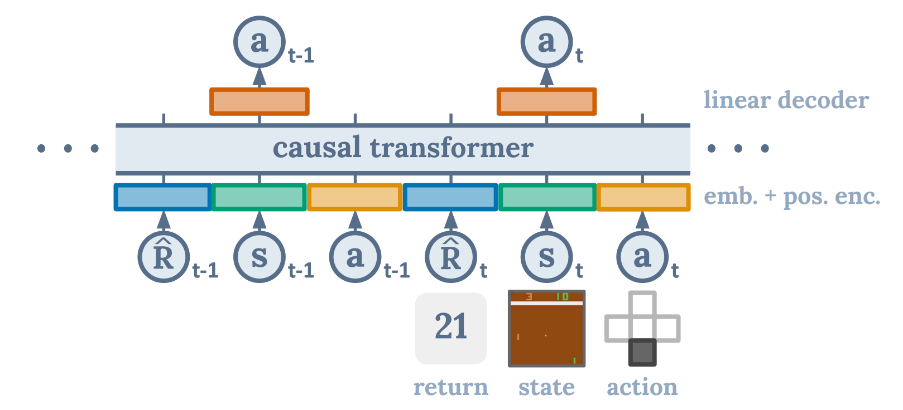

# RofuncRL DTrans (Decision Transformer)

**Paper:** “Decision Transformer: Reinforcement Learning via Sequence Modeling”. Chen et al. 2021.
https://arxiv.org/abs/2106.01345

## Algorithm

Decison Transfer is an *offline reinforcement learning method* that learns a policy from a dataset of expert
demonstrations. Unlike prior approaches to RL that fit value functions or compute policy gradients,
Decision Transformer simply outputs the optimal actions by leveraging a causally
masked Transformer. By conditioning an autoregressive model on the desired
return (reward), past states, and actions, Decision Transformer model can generate future actions that achieve the
desired return. 