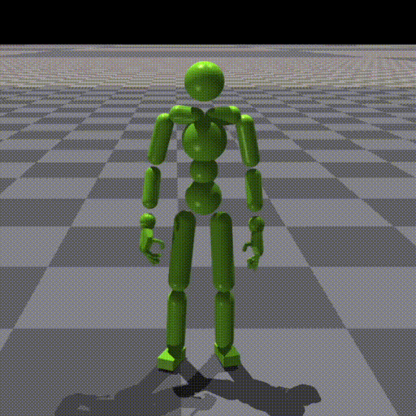
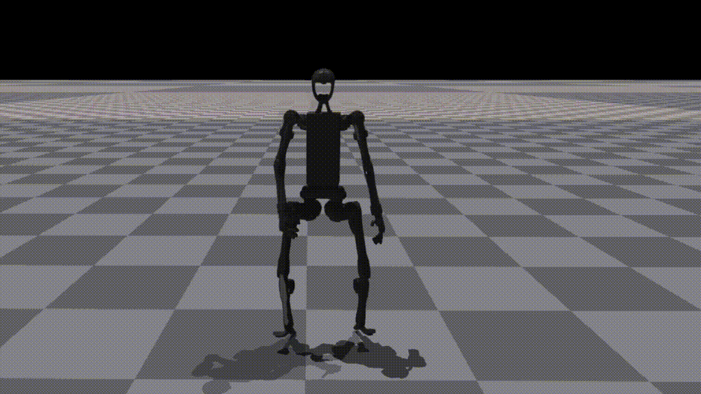
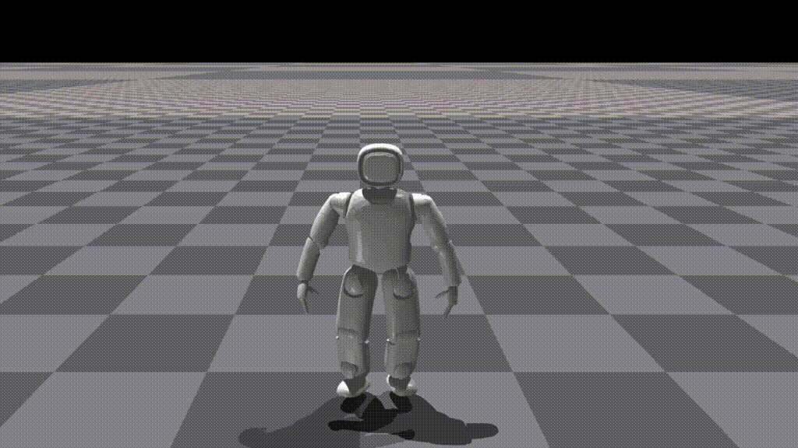
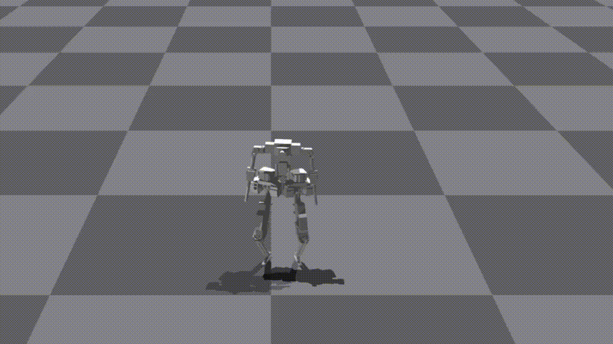
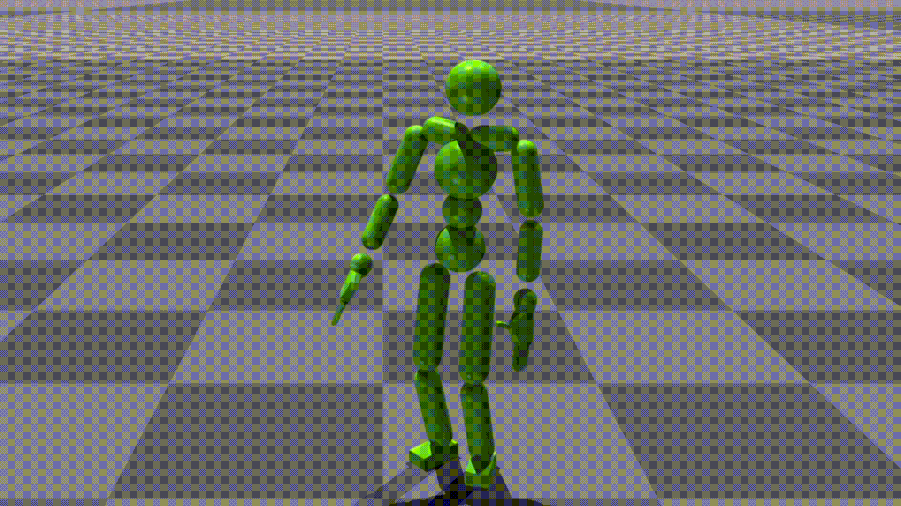
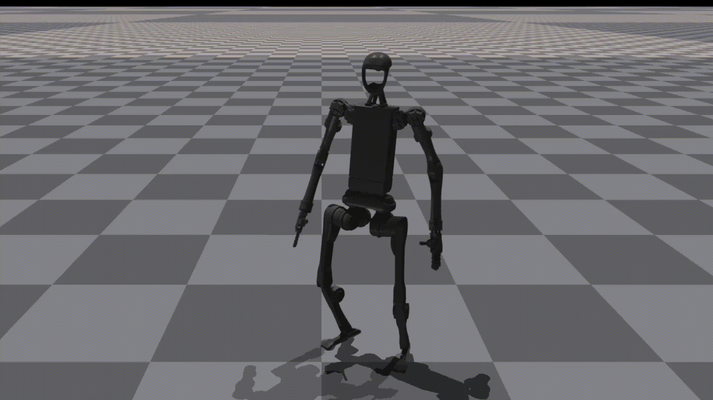
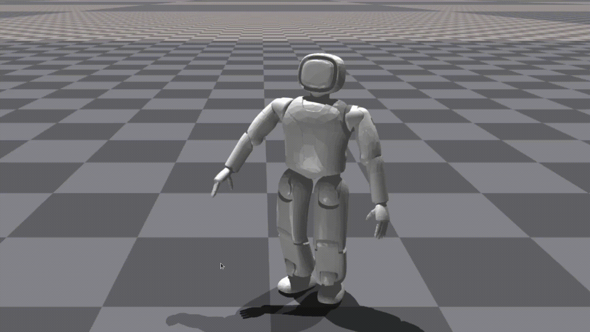
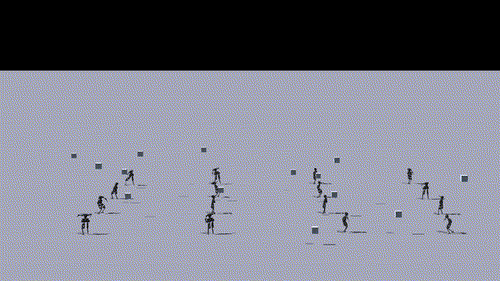

# Human-Humanoid Robots Cross-Embodiment  Behavior-Skill Transfer Using Decomposed Adversarial Learning from Demonstration

Loading will take a few seconds. Please wait.

You can also refer to the page in [doc](https://rofunc.readthedocs.io/en/latest/lfd/RofuncRL/HOTU.html).

## Kinematic Motion Retargeting

## Perturb after Behavior Primitive Pre-training

## Box Carrying Task (from random starting position to random target position with different box sizes)

