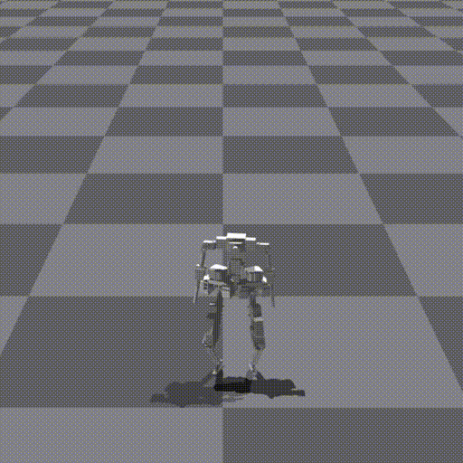

# Human-Humanoid Robots Cross-Embodiment  Behavior-Skill Transfer Using Decomposed Adversarial Learning from Demonstration

Due to the large number of GIFs on this page (though I've tried my best to compress and speed up these GIFs), loading may take a bit longer—**thank you for your patience**.

You can either view the [GitHub page](https://github.com/Skylark0924/Rofunc/blob/main/doc/source/lfd/RofuncRL/HOTU.md) or the precompiled [document](https://rofunc.readthedocs.io/en/latest/lfd/RofuncRL/HOTU.html). Please feel free to decide based on the loading speed.

## Kinematic Motion Retargeting

### Speed: 4x

## Perturb after Behavior Primitive Pre-training

### Speed: 1x

## Box Carrying Task (from random starting position to random target position with different box sizes) 

### Speed: 4x

