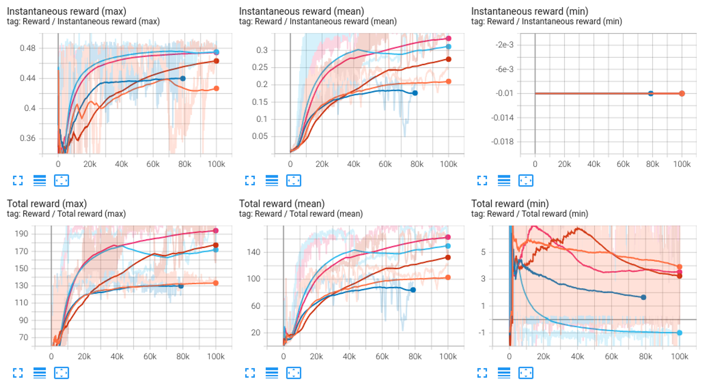
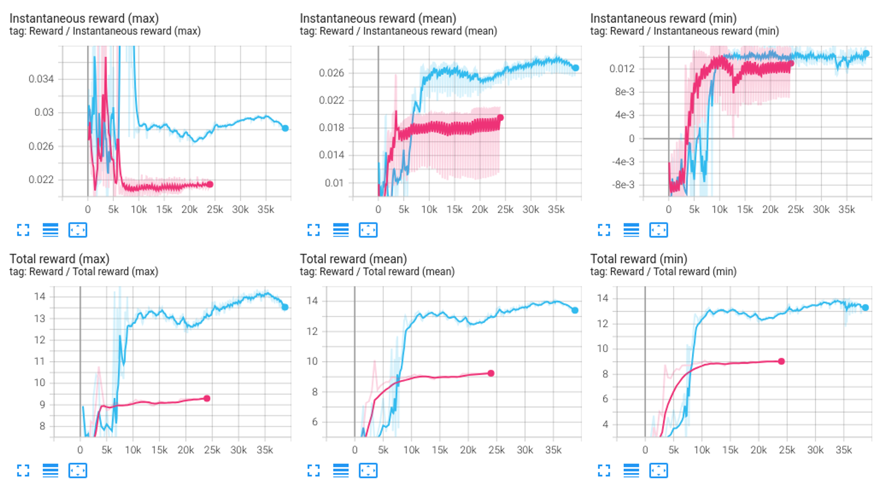
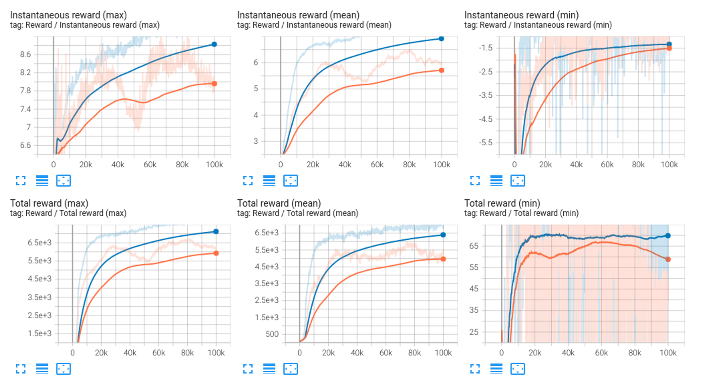
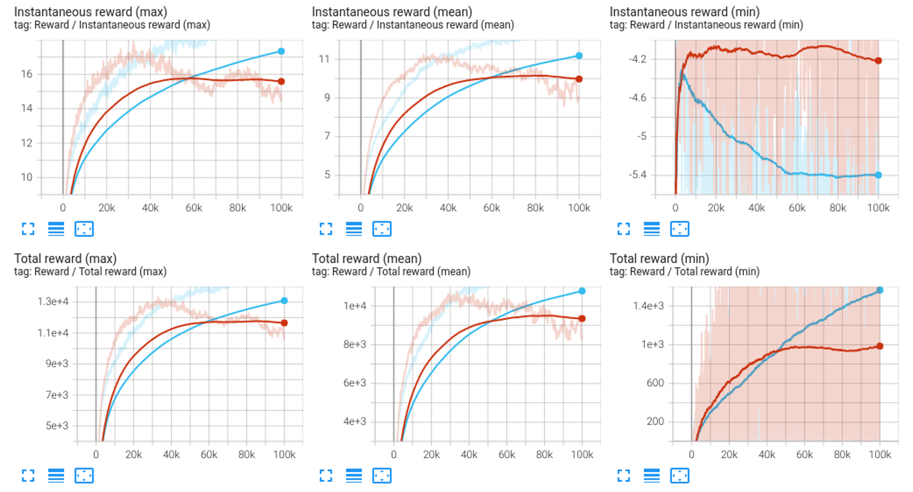

# RofuncRL PPO (Proximal Policy Optimization)

**Paper:** “Proximal Policy Optimization Algorithms”. John Schulman. et al. 2017. https://arxiv.org/abs/1707.06347

## Algorithm 

The PPO algorithm is a policy gradient method that uses a surrogate objective function to constrain the policy update. 
The objective function is defined as:

$$
    L^{C L I P}(\theta)=\hat{\mathbb{E}}_t\left[\min \left(r_t(\theta) \hat{A}_t, \operatorname{clip}\left(r_t(\theta), 1-\epsilon, 1+\epsilon\right) \hat{A}_t\right)\right]
$$


where ratio $r_t(\theta)$ refers to the ratio of the probability of the action under the new and old policies. It is defined as:

$$
    r_t(\theta)=\frac{\pi_\theta\left(a_t \mid s_t\right)}{\pi_{\theta_{\text {old }}}\left(a_t \mid s_t\right)}
$$


and $\hat{A}_t$ is the advantage estimation function. It is an estimate of how much better or worse an action is compared to the average action at that state. The advantage function is defined as:

$$
    \hat{A}_t=\sum_{l=0}^{\infty} \gamma^{l} r_{t+l}+\gamma^{l+1} V\left(s_{t+l}\right)-V\left(s_{t}\right)
$$


where $\delta_t^V$ is the TD error and $V(s_t)$ is the value function. The value function is updated by minimizing the TD error:

$$
    \delta_t^V=r_t+\gamma V\left(s_{t+1}\right)-V\left(s_{t}\right)
$$


## Demos

### CURICabinet


```shell
python examples/learning_rl/example_CURICabinet_RofuncRL.py --inference
```
## Performance comparison

We compare the performance of the PPO algorithm with different tricks and an open source baseline 
([SKRL](https://github.com/Toni-SM/skrl/tree/main)). These experiments were conducted on the `CURICabinet`, `FrankaCabinet`, `Humanoid` and `Ant` environment. The results are shown below:

### CURICabinet

- `Orange`: SKRL PPO
- `Dark Blue`: Rofunc PPO sharing the backbone in the policy network and value network
- `Red`: Rofunc PPO with independent policy network and value network
- `Light Blue`: Rofunc PPO with independent policy network and value network, using network initialization
- `Pink`: Rofunc PPO with independent policy network and value network, using network initialization and entropy

### FrankaCabinet

- `Pink`: SKRL PPO
- `Blue`: Rofunc PPO

### Humanoid

- `Orange`: SKRL PPO
- `Blue`: Rofunc PPO

### Ant

- `Red`: SKRL PPO
- `Blue`: Rofunc PPO

## Tricks

### Normalization

1. State Normalization

2. Value Normalization

3. Advantage Normalization

### Reward Scaling

### Network Initialization

### Entropy

### Learning Rate Scheduler

### Gradient Clipping

### Activation Function

### Optimizer

## Network update function

```{literalinclude} ../../../../rofunc/learning/RofuncRL/agents/online/ppo_agent.py
:pyobject: PPOAgent.update_net
```