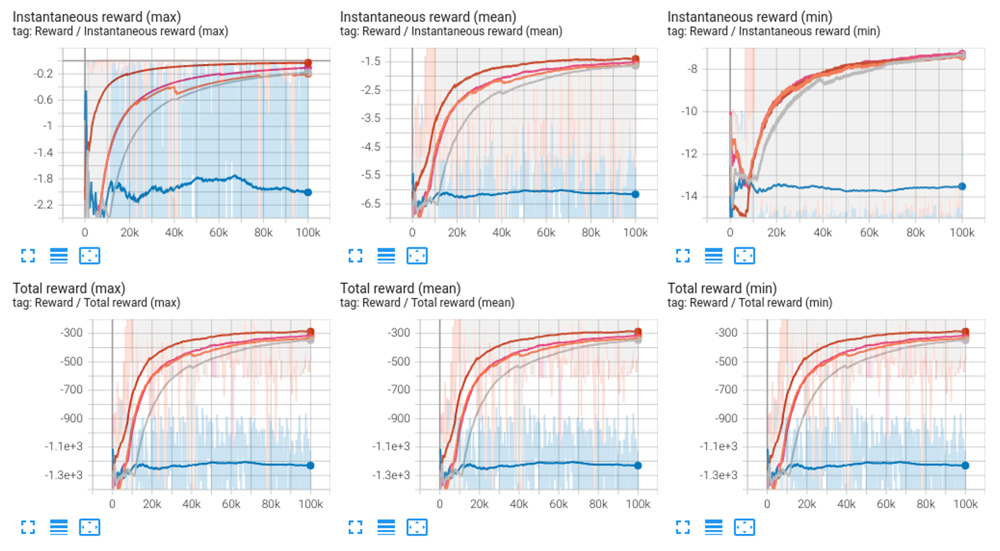

# RofuncRL SAC (Soft Actor-Critic)

**Paper:** "Soft Actor-Critic Algorithms and Applications". Haarnoja et al. 2018. https://arxiv.org/abs/1812.05905


## Algorithm 

```{literalinclude} ../../../../rofunc/learning/RofuncRL/agents/online/sac_agent.py
:pyobject: SACAgent.update_net
```

## Performance comparison

We compare the performance of the SAC algorithm with different tricks and an open source baseline 
([SKRL](https://github.com/Toni-SM/skrl/tree/main)). These experiments were conducted on the `Pendulum` environment. 
The results are shown below:

### Pendulum

- `Pink`: SKRL SAC
- `Blue`: Rofunc SAC with ReLU activation function and batch size of 64
- `Orange`: Rofunc SAC with Tanh activation function and batch size of 64
- `Gray`: Rofunc SAC with ELU activation function and batch size of 512
- `Red`: Rofunc SAC with ELU activation function and batch size of 64