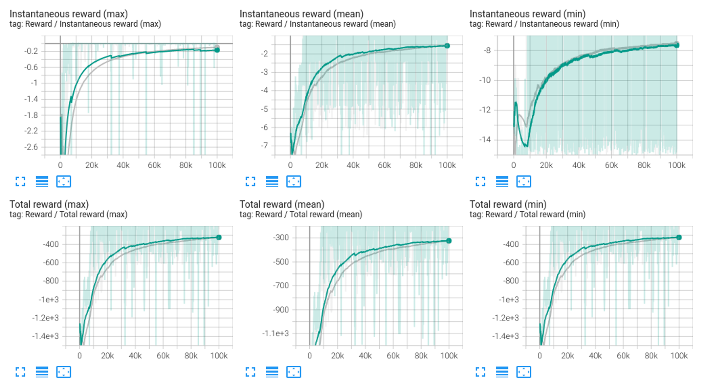

# RofuncRL TD3 (Twin Delayed Deep Deterministic Policy Gradient)

**Paper:** “Addressing Function Approximation Error in Actor-Critic Methods”. Fujimoto. et al. 2018. https://arxiv.org/abs/1802.09477

## Algorithm 

```{literalinclude} ../../../../rofunc/learning/RofuncRL/agents/online/td3_agent.py
:pyobject: TD3Agent.update_net
```

## Performance comparison

We compare the performance of the TD3 algorithm with different tricks and an open source baseline 
([SKRL](https://github.com/Toni-SM/skrl/tree/main)). These experiments were conducted on the `Pendulum` environment. 
The results are shown below:

### Pendulum

- `Gray`: SKRL TD3
- `Green`: Rofunc TD3
