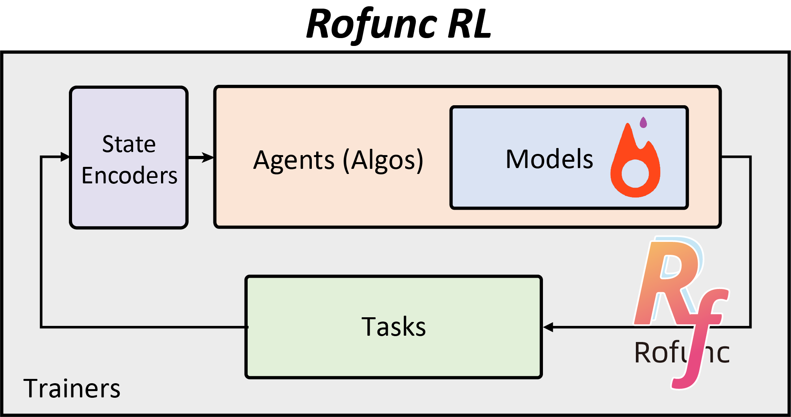

Reinforcement learning class (RofuncRL)
=================================

Online reinforcement learning
-----------------------------

:doc:`overview`
    Overview of the `RofuncRL` subpackage
:doc:`A2C`
    A2C implementation and explanation of tricks in `RofuncRL`
:doc:`PPO`
    PPO implementation and explanation of tricks in `RofuncRL`
:doc:`TD3`
    TD3 implementation and explanation of tricks in `RofuncRL`
:doc:`SAC`
    SAC implementation and explanation of tricks in `RofuncRL`

Offline reinforcement learning
------------------------------

:doc:`CQL`
    CQL implementation and explanation of tricks in `RofuncRL`
:doc:`BCQ`
    BCQ implementation and explanation of tricks in `RofuncRL`
:doc:`DTrans`
    DTrans implementation and explanation of tricks in `RofuncRL`
:doc:`TD3-BC`
    TD3+BC implementation and explanation of tricks in `RofuncRL`
:doc:`EDAC`
    EDAC implementation and explanation of tricks in `RofuncRL`

Mixline (Mixing online and offline) reinforcement learning
----------------------------------------------------------

:doc:`AMP`
    AMP implementation and explanation of tricks in `RofuncRL`
:doc:`ASE`
    ASE implementation and explanation of tricks in `RofuncRL`
:doc:`ODTrans`
    ODTrans implementation and explanation of tricks in `RofuncRL`
:doc:`HOTU`
    HOTU implementation and explanation of tricks in `RofuncRL`

.. toctree::
   :maxdepth: 2
   :hidden:
   :glob:

   overview
   A2C
   PPO
   TD3
   SAC
   CQL
   BCQ
   DTrans
   TD3-BC
   EDAC
   AMP
   ASE
   ODTrans
   HOTU
