# Quick start

Here we provide a simple but interesting example: learning to play Taichi by learning from human demonstration.

First, we need to import our package and some relative packages:

```python
import rofunc as rf
import numpy as np
from isaacgym import gymutil
```

## Start with human demonstration

### Demonstration collection

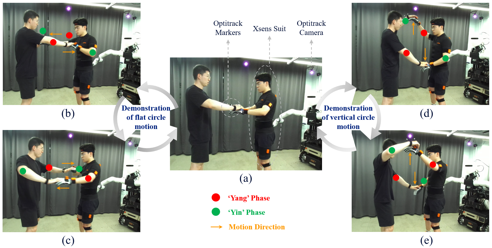

Two types of Tai Chi pushing hand with fixed step are defined and demonstrated by two individuals, which includes the motion of flat circles (repetition of a → b → c → a) and vertical circles (repetition of a → d → e → a). The person whose hand motions are supposed to be learned by CURI was wearing the Xsens suit and the Optitrack markers on his back for global localization while the partner was attached with two markers on both hands for trajectory recording. Starting with the initial phase a, the cycle of the confrontational pushing hand movement is separated into two phases, which are the
’Yin’ phase and the ’Yang’ phase from the perspective of one single hand. The hands of demonstrators marked by the red solid circle represent that they were in the ’Yang’ phase while the green solid circle represents the ’Yin’ phase. The directions of hand motions were indicated by the orange arrow. For instance, during the motion of a → b → c → a, the left hand of the demonstrator on the left side performs stiff to push the opponent’s hand as ’Yang’ motion and then becomes compliant to comply with the  opponent’s motion with a pulling back action as ’Yin’ motion. (We declare that the individuals in this figure are both authors and they gave permission for the use of their image.)

### Data pre-processing

As describing in the [`Demonstration collection and pre-processing`](./devices/index.rst) section.


## Learning from demonstration

### TP-GMM
```python
# Demo
raw_demo_l = np.load('/home/ubuntu/Data/2022_09_09_Taichi/xsens_mvnx/010-058/LeftHand.npy')
raw_demo_r = np.load('/home/ubuntu/Data/2022_09_09_Taichi/xsens_mvnx/010-058/RightHand.npy')
demos_x_l = [raw_demo_l[300:435, :], raw_demo_l[435:570, :], raw_demo_l[570:705, :]]
demos_x_r = [raw_demo_r[300:435, :], raw_demo_r[435:570, :], raw_demo_r[570:705, :]]
rf.lqt.plot_3d_bi(demos_x_l, demos_x_r, ori=False, save=False)

# TP-GMM
show_demo_idx = 1
_, _, gmm_rep_l, gmm_rep_r = rf.tpgmm.bi(demos_x_l, demos_x_r, show_demo_idx=show_demo_idx, plot=True)
```

**Visualization of bimanual demonstration data**

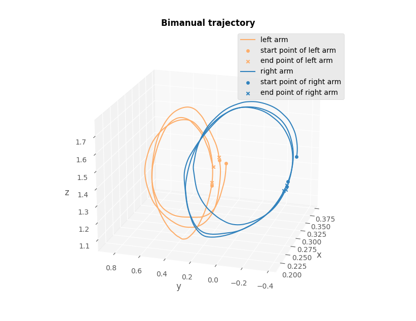

**TP-GMM representation of bimanual demonstration data**

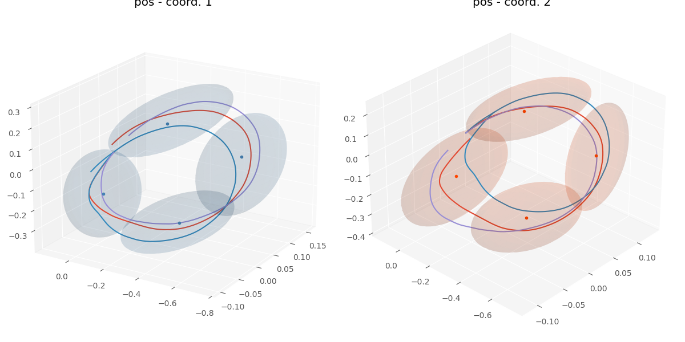

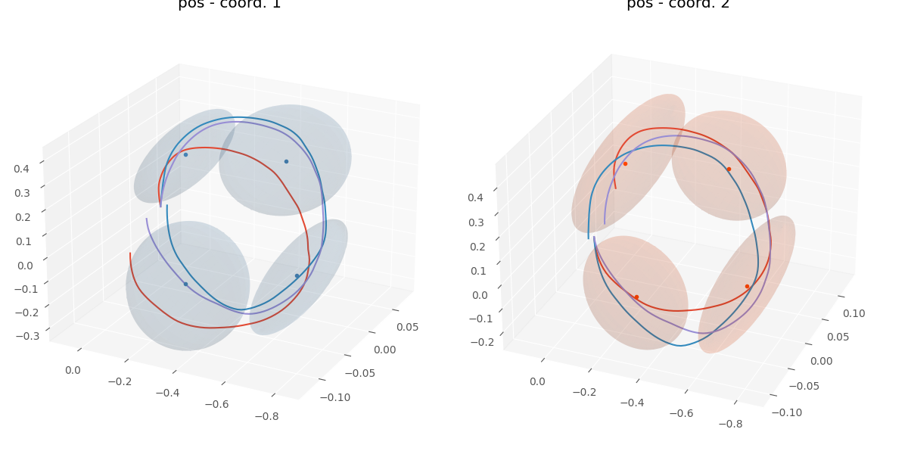

**Reproduction of the bimanual trajectory**

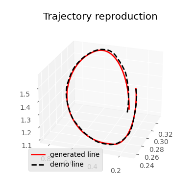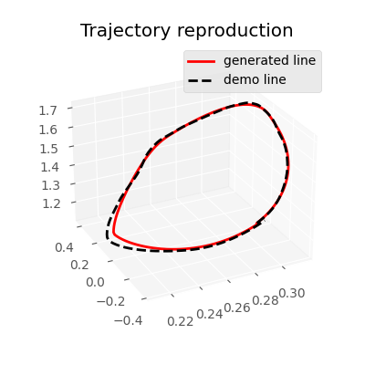

### TP-GMR

```python
# TP-GMR
start_pose = gmm_rep_l[-1][:7]
end_pose = gmm_rep_l[0][:7]
model_l, rep_l = rf.tpgmr.uni(demos_x_l, show_demo_idx, start_pose, end_pose, plot=False)
rep_l = np.vstack((gmm_rep_l[:, :7], rep_l[:, :7]))

start_pose = gmm_rep_r[-1][:7]
end_pose = gmm_rep_r[0][:7]
model_r, rep_r = rf.tpgmr.uni(demos_x_r, show_demo_idx, start_pose, end_pose, plot=False)
rep_r = np.vstack((gmm_rep_r[:, :7], rep_r[:, :7]))
```

**TP-GMR representation of bimanual demonstration data**

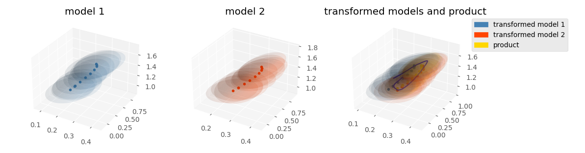

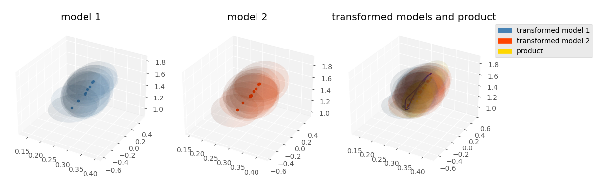

**Generation for connecting the start & end points and transforming them into a periodic motion**

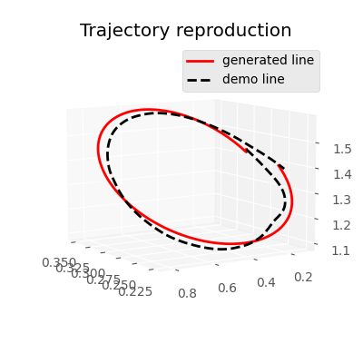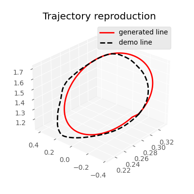

## Planning and control

### Linear Quadratic Tracking (LQT)
```python
# LQT
param = {
    "nbData": 200,  # Number of data points
    "nbVarPos": 7,  # Dimension of position data
    "nbDeriv": 2,  # Number of static and dynamic features (2 -> [x,dx])
    "dt": 1e-2,  # Time step duration
    "rfactor": 1e-8  # Control cost
}
param["nb_var"] = param["nbVarPos"] * param["nbDeriv"]  # Dimension of state vector

data = np.zeros((len(rep_l), 14))
data[:, :7] = rep_l[:, :7]
filter_indices = [i for i in range(0, len(rep_l) - 10, 5)]
filter_indices.append(len(rep_l) - 1)
data = data[filter_indices]
u_hat_l, x_hat_l, muQ_l, idx_slices_l = rf.lqt.uni_recursive(param, data, interval=2)

data = np.zeros((len(rep_r), 14))
data[:, :7] = rep_r[:, :7]
filter_indices = [i for i in range(0, len(rep_r) - 10, 5)]
filter_indices.append(len(rep_r) - 1)
data = data[filter_indices]
u_hat_r, x_hat_r, muQ_r, idx_slices_r = rf.lqt.uni_recursive(param, data, interval=2)
rf.lqt.plot_3d_bi(x_hat_l, x_hat_r, ori=False, save=True,
                  save_file_name=['/home/ubuntu/Data/2022_09_09_Taichi/lqt_rep6_l.npy',
                                  '/home/ubuntu/Data/2022_09_09_Taichi/lqt_rep6_r.npy'])

x_hat_l = np.load('/home/ubuntu/Data/2022_09_09_Taichi/lqt_rep6_l.npy')[0]
x_hat_r = np.load('/home/ubuntu/Data/2022_09_09_Taichi/lqt_rep6_r.npy')[0]
rf.lqt.plot_3d_bi(x_hat_l, x_hat_r, ori=False, save=False)
```

**Smooth trajectory interpolated by LQT**

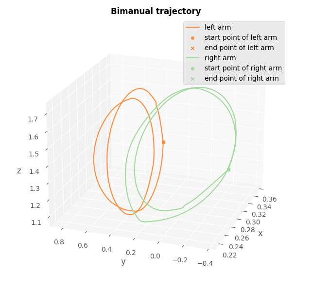

## Simulator

### CURI simulation

```python
# Adjust the workspace to fit the CURI robot
x_hat_l[:, 0] += 0.4
x_hat_r[:, 0] += 0.4
x_hat_l[:, 1] -= 0.2
x_hat_r[:, 1] -= 0.2
x_hat_l[:, 1] = -x_hat_l[:, 1]
x_hat_r[:, 1] = -x_hat_r[:, 1]
x_hat_l[:, 6] = -x_hat_l[:, 6]
# Simulation
args = gymutil.parse_arguments()
rf.curi.run_traj_bi(args, x_hat_l, x_hat_r)
```


**Another types of Taichi pushing hand**

