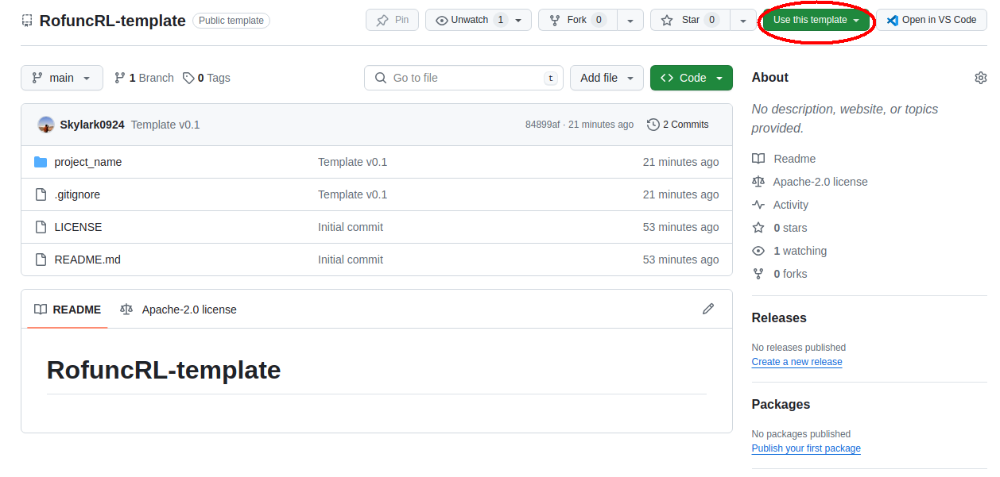

# RofuncRL tutorial

This tutorial shows how to customize your own project based on [`RofuncRL`](https://rofunc.readthedocs.io/en/latest/lfd/RofuncRL/index.html).

## Project structure

```plaintext
project_name/
├── configs/
│   ├── task/
│   │   ├── task_config1.yaml  # task-specific config
│   │   ├── task_config2.yaml
│   │   ├── ...
│   ├── train/
│   │   ├── train_config1.yaml  # training-specific config according to the agent
│   │   ├── train_config2.yaml
│   │   ├── ...
│   ├── config.yaml  # just copy the default config.yaml from RofuncRL
├── agents/  # optional, if you want to define your own agent
│   ├── __init__.py
│   ├── new_agent.py
│   ├── new_agent2.py
│   ├── ...
├── models/  # optional, if you want to define your own model
│   ├── __init__.py
│   ├── ...
├── tasks/  # your own task definition
│   ├── __init__.py
│   ├── myenv.py
│   ├── ...
├── trainers/  # optional, if you want to define your own trainer
│   ├── __init__.py
│   ├── new_trainer.py
│   ├── ...
├── ...
├── main.py  # your own training and inference script
```

We provide a [**RofuncRL-based repository template**](https://github.com/Skylark0924/RofuncRL-template) to generate your own repository following the RofuncRL structure by one click.



:::{tip}
For more details about the configuration system, please refer to [Configuration System](https://rofunc.readthedocs.io/en/latest/tutorial/config_system.html).
:::


## Define your env as OpenAI Gym Env

Create a file named like `myenv.py` and define your own task as following:

```python
import gym
# Or
import gymnasium as gym
from gym.spaces import Box


class MyEnv(gym.Env):
    def __init__(self, cfg, **kwargs):
        ...
        obs_shape = ...
        act_shape = ...
        self.observation_space = Box(-np.inf, np.inf, obs_shape)
        self.action_space = Box(-1, 1, act_shape)

    def reset(self):
        obs = ...
        info = {}
        # For gym, just return obs (deprecated api)
        return obs
        # For gymnasium, return obs and info
        # return obs, info  


    def step(self, action):
        obs = self._get_obs(action)
        rew = self._get_rew(obs)
        terminated = self._get_done(obs)
        ...

        # For gym, just return obs (deprecated api)
        return obs, reward, terminated, info
        # For gymnasium, return obs and info
        return obs, reward, terminated, truncated, info
```

## Train and inference script

Create a file named like `main.py` and define your own training script as following:

```python
import argparse

from rofunc.config.utils import get_config
from rofunc.learning.RofuncRL.trainers import trainer_map
from myenv import MyEnv


def train(custom_args):
    args_overrides = ["task={}".format(custom_args.task),
                      "train={}{}{}".format(custom_args.task, custom_args.mode, custom_args.agent)]
    cfg = get_config(absl_config_path=..., config_name=..., args=args_overrides)

    env = MyEnv(cfg.task)
    trainer = trainer_map[custom_args.agent](cfg=cfg, env=env, 
                                             device=custom_args.device, env_name=custom_args.task)

    # Start training
    trainer.train()


def inference(custom_args):
    args_overrides = ["task={}".format(custom_args.task),
                      "train={}{}{}".format(custom_args.task, custom_args.agent)]
        cfg = get_config(absl_config_path=..., config_name=..., args=args_overrides)


    env = make_env(custom_args, cfg.task)
    trainer = trainer_map[custom_args.agent](cfg=cfg, env=env, 
                                             device=custom_args.device, env_name=custom_args.task)

    trainer.agent.load_ckpt(custom_args.ckpt_path)
    trainer.inference()

if __name__ == '__main__':
    gpu_id = 0

    parser = argparse.ArgumentParser()
    parser.add_argument("--task", type=str, default="DoughRolling")
    parser.add_argument("--agent", type=str, default="PPO")
    parser.add_argument("--device", type=str, default=f"cuda:{gpu_id}")
    parser.add_argument("--inference", action="store_true", help="turn to inference mode while adding this argument")
    parser.add_argument("--ckpt_path", type=str, default=None)
    custom_args = parser.parse_args()

    if not custom_args.inference:
        train(custom_args)
    else:
        inference(custom_args)
```

