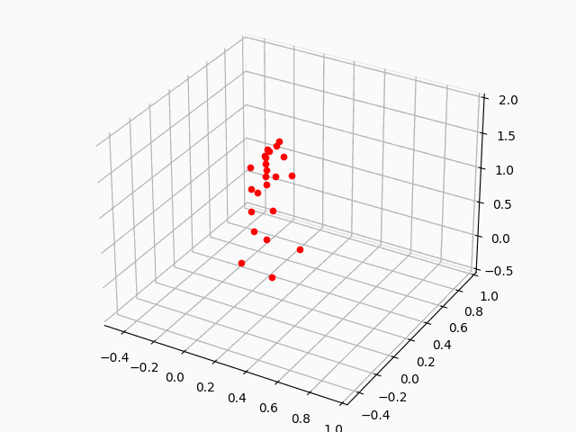
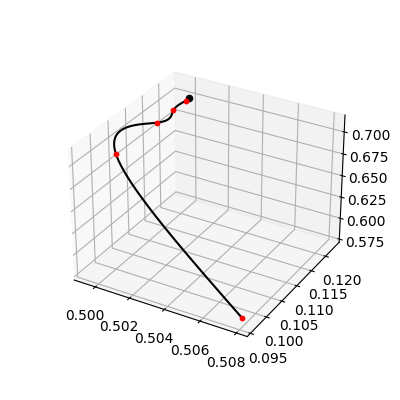
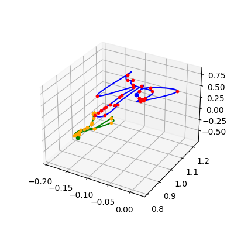

# Robotics Functions (RoFunc)


## Hello, robot world!

```
pip install rofunc
```

```python
import rofunc as rf
```

## Available functions

| Classes                         | Types       | Functions             | Description                                                          | Status |
|---------------------------------|-------------|-----------------------|----------------------------------------------------------------------|--------|
| **Devices**                     | Xsens       | `xsens.record`        | Record the human motion via network streaming                        |        |
|                                 |             | `xsens.process`       | Decode the .mvnx file                                                | ✅      |
|                                 |             | `xsens.visualize`     | Show or save gif about the motion                                    | ✅      |
|                                 | Optitrack   | `optitrack.record`    | Record the motion of markers via network streaming                   |        |
|                                 |             | `optitrack.process`   | Process the output .csv data                                         | ✅      |
|                                 |             | `optitrack.visualize` | Show or save gif about the motion                                    |        |
|                                 | ZED         | `zed.record`          | Record with multiple cameras                                         | ✅      |
|                                 |             | `zed.playback`        | Playback the recording and save snapshots                            | ✅      |
|                                 |             | `zed.export`          | Export the recording to mp4                                          | ✅      |
|                                 | Multi-modal | `mmodal.record`       | Record multi-modal demonstration data simultaneously                 |        |
|                                 |             | `mmodal.export`       | Export multi-modal demonstration data in one line                    | ✅      |
| **Logger**                      |             | `logger.write`        | Custom tensorboard-based logger                                      |        |
| **Coordinate**                  |             | `coord.custom_class`  | Define the custom class of `Pose`                                    |        |
|                                 |             | `coord.transform`     | Useful functions about coordinate transformation                     |        |
| **VisuaLab**                    | 2D          | `visualab.2d`         | 2-dim trajectory visualization                                       |        |
|                                 | 3D          | `visualab.3d`         | 3-dim trajectory visualization                                       |        |
|                                 | 3D with ori | `visualab.3dori`      | 3-dim trajectory visualization with orientation                      |        |
| **Planning**                    | LQT         | `lqt.uni`             | LQT for one agent with several via-points                            | ✅      |
|                                 |             | `lqt.bi`              | LQT for two agent with coordination constraints                      | ✅      |
| **Learning from Demonstration** | DMP         | `dmp.uni`             | DMP for one agent with several (or one) demonstrated trajectories    |        |
|                                 | TP-GMM      | `tpgmmm.uni`          | TP-GMM for one agent with several (or one) demonstrated trajectories | ✅      |
|                                 |             | `tpgmmm.bi`           | TP-GMM for two agent with coordination learned from demonstration    | ✅      |


- [Robotics Functions (RoFunc)](#robotics-functions-rofunc)
  - [Hello, robot world!](#hello-robot-world)
  - [Available functions](#available-functions)
  - [Devices](#devices)
    - [Xsens](#xsens)
      - [Convert mvnx file to npys](#convert-mvnx-file-to-npys)
      - [Visualize the motion data](#visualize-the-motion-data)
    - [Optitrack](#optitrack)
      - [Get useful data](#get-useful-data)
      - [Visualize the motion data](#visualize-the-motion-data-1)
    - [Zed](#zed)
      - [Record](#record)
      - [Playback](#playback)
  - [Planning](#planning)
    - [LQT](#lqt)
      - [Uni](#uni)
      - [Bimanual](#bimanual)

## Devices

### Xsens

#### Convert mvnx file to npys

`get_skeleton(mvnx_path, output_dir=None)`

```python
import rofunc as rf

mvnx_file = '/home/ubuntu/Data/06_24/Xsens/dough_01.mvnx'
rf.xsens.get_skeleton(mvnx_file) 
```

Then you will get a folder with multiple .npy files, each one refers to one segment.

> We also provide a batch form for converting mvnx files in parallel.

```python
import rofunc as rf

mvnx_dir = '../xsens_data'
rf.xsens.get_skeleton_batch(mvnx_dir)
```

#### Visualize the motion data

After obtains data of each segment, we can get a whole-body visualization
by `plot_skeleton(skeleton_data_path: str, save_gif=False)`

```python
import rofunc as rf

# dough_01 must be a folder with multiple .npy files about the skeleton which can be generated by `get_skeleton`
skeleton_data_path = './xsens_data/dough_01'
rf.xsens.plot_skeleton(skeleton_data_path)
```



> We also provide a batch form for saving gifs of several skeleton data in parallel.

```python
import rofunc as rf

# There must contain a folder with multiple .npy files about the skeleton which can be generated by `get_skeleton`
skeleton_dir = './xsens_data/'
rf.xsens.plot_skeleton_batch(skeleton_dir)
```

### Optitrack

#### Get useful data

You need first prepare your raw data in the following structure.

```
├── dough_01
│   ├── Take 2022-06-24 07.40.52 PM.csv
│   ├── Take 2022-06-24 07.40.52 PM_ManusVRGlove_3f6ec26f_3f6ec26f.csv (if applicable)
│   └── Take 2022-06-24 07.40.52 PM_ManusVRGlove_7b28f20b_7b28f20b.csv (if applicable)
├── dough_02
│   ├── Take 2022-06-24 07.44.15 PM.csv
│   ├── Take 2022-06-24 07.44.15 PM_ManusVRGlove_3f6ec26f_3f6ec26f.csv (if applicable)
│   └── Take 2022-06-24 07.44.15 PM_ManusVRGlove_7b28f20b_7b28f20b.csv (if applicable)
├── dough_03
...
```

You can get the useful data by `data_clean(input_path)`

```python
import rofunc as rf

root_path = '/home/ubuntu/Github/DGform/data/opti_data/dough_01'
rf.optitrack.data_clean(root_path)
```

Then you will obtain new csv files in the same directory.

```
├── dough_01
│   ├── left_manus.csv
│   ├── opti_hands.csv
│   ├── process
│   │   ├── Take 2022-06-24 07.40.52 PM_ManusVRGlove_3f6ec26f_3f6ec26f.csv
│   │   └── Take 2022-06-24 07.40.52 PM_ManusVRGlove_7b28f20b_7b28f20b.csv
│   ├── right_manus.csv
│   ├── Take 2022-06-24 07.40.52 PM.csv
│   ├── Take 2022-06-24 07.40.52 PM_ManusVRGlove_3f6ec26f_3f6ec26f.csv
│   └── Take 2022-06-24 07.40.52 PM_ManusVRGlove_7b28f20b_7b28f20b.csv
├── dough_02
│   ├── left_manus.csv
│   ├── opti_hands.csv
│   ├── process
│   │   ├── Take 2022-06-24 07.44.15 PM_ManusVRGlove_3f6ec26f_3f6ec26f.csv
│   │   └── Take 2022-06-24 07.44.15 PM_ManusVRGlove_7b28f20b_7b28f20b.csv
│   ├── right_manus.csv
│   ├── Take 2022-06-24 07.44.15 PM.csv
│   ├── Take 2022-06-24 07.44.15 PM_ManusVRGlove_3f6ec26f_3f6ec26f.csv
│   └── Take 2022-06-24 07.44.15 PM_ManusVRGlove_7b28f20b_7b28f20b.csv
├── dough_03
...
```

> We also provide a batch form cleaning several data in parallel.

```python 
import rofunc as rf

input_dir = '/home/ubuntu/Github/DGform/data/opti_data/'
rf.optitrack.process.data_clean_batch(input_dir)
```

#### Visualize the motion data

### Zed

#### Record

It is capable to check the camera devices connected to the computer autonomously and record multiple cameras in
parallel.

```python 
import rofunc as rf

root_dir = '/home/ubuntu/Data/zed_record'
exp_name = '20220909'
rf.zed.record(root_dir, exp_name)
```

#### Playback

It is capable to check the camera devices connected to the computer autonomously and record multiple cameras in
parallel.

```python 
import rofunc as rf

recording_path = '/home/ubuntu/Data/06_24/Video/20220624_1649/38709363.svo'
rf.zed.playback(recording_path)
```

You can save the snapshots as prompted

```
Reading SVO file: /home/ubuntu/Data/06_24/Video/20220624_1649/38709363.svo
  Save the current image:     s
  Quit the video reading:     q

Saving image 0.png : SUCCESS
Saving image 1.png : SUCCESS
Saving image 2.png : SUCCESS
Saving image 3.png : SUCCESS
...
```

#### Export

```python
def export(filepath, mode=1):
    """
    Export the svo file with specific mode.
    Args:
        filepath: SVO file path (input) : path/to/file.svo
        mode: Export mode:  0=Export LEFT+RIGHT AVI.
                            1=Export LEFT+DEPTH_VIEW AVI.
                            2=Export LEFT+RIGHT image sequence.
                            3=Export LEFT+DEPTH_VIEW image sequence.
                            4=Export LEFT+DEPTH_16Bit image sequence.

    Returns:

    """
```

```python
import rofunc as rf

rf.zed.export('/home/ubuntu/Data/06_24/Video/20220624_1649/38709363.svo', 2)
```

```python
import rofunc as rf

rf.zed.export_batch('/home/ubuntu/Data/06_24/Video/20220624_1649', core_num=20)
```

### Multi-modal

#### Export

The raw data folder should have these following contents:

```
.
├── optitrack_csv (necessary)
│   ├── exp_01
│   │   ├── Take 2022-09-09 06.32.26 PM.csv
│   │   ├── Take 2022-09-09 06.32.26 PM_ManusVRGlove_3f6ec26f_3f6ec26f.csv
│   │   └── Take 2022-09-09 06.32.26 PM_ManusVRGlove_7b28f20b_7b28f20b.csv
│   └── exp_02
│       ├── Take 2022-09-09 06.34.11 PM.csv
│       ├── Take 2022-09-09 06.34.11 PM_ManusVRGlove_3f6ec26f_3f6ec26f.csv
│       └── Take 2022-09-09 06.34.11 PM_ManusVRGlove_7b28f20b_7b28f20b.csv
├── xsens_mvnx (necessary)
│   ├── exp_01.mvnx
│   ├── ...
└── zed (necessary)
    ├── HD1080_SN38709363_18-24-20.svo
    ├── ...
 
```


```python
import rofunc as rf

rf.mmodal.export('/home/ubuntu/Data/2022_09_09_Taichi')
```

## Planning

### LQT

#### Unimanual

```python
import rofunc as rf
import numpy as np

param = {
    "nbData": 500,   # Number of data points
    "nbVarPos": 7,   # Dimension of position data
    "nbDeriv": 2,    # Number of static and dynamic features (2 -> [x,dx])
    "dt": 1e-2,      # Time step duration
    "rfactor": 1e-8  # Control cost
}
param["nb_var"] = param["nbVarPos"] * param["nbDeriv"]  # Dimension of state vector

data = np.load('data/z_manipulator_poses.npy')
filter_indices = [0, 1, 5, 10, 22, 36]
data = data[filter_indices]

u_hat, x_hat, muQ, idx_slices = rf.lqt.uni(param, data)
rf.lqt.plot_3d_uni(x_hat, muQ, idx_slices, ori=False, save=False)
```



#### Bimanual

> Currently, there is no coordination between the generated bimanual trajectories.

```python
import rofunc as rf
import numpy as np

param = {
    "nbData": 500,  # Number of data points
    "nbVarPos": 7,  # Dimension of position data
    "nbDeriv": 2,  # Number of static and dynamic features (2 -> [x,dx])
    "dt": 1e-2,  # Time step duration
    "rfactor": 1e-8  # Control cost
}
param["nb_var"] = param["nbVarPos"] * param["nbDeriv"]  # Dimension of state vector

data = np.loadtxt('data/link7_loc_ori.txt', delimiter=', ')
l_data = data[0:len(data):2]
r_data = data[1:len(data):2]
u_hat_l, u_hat_r, x_hat_l, x_hat_r, muQ_l, muQ_r, idx_slices = rf.lqt.bi(param, l_data, r_data)
rf.lqt.plot_3d_bi(x_hat_l, x_hat_r, muQ_l, muQ_r, idx_slices, ori=False, save=False)
```




## Learning from Demonstration

### TP-GMM

#### Unimanual

```python
import rofunc as rf
import numpy as np

demo_points = np.array([[[0, 0], [-1, 8], [4, 3], [2, 1], [4, 3]],
                        [[0, -2], [-1, 7], [3, 2.5], [2, 1.6], [4, 3]],
                        [[0, -1], [-1, 8], [4, 5.2], [2, 1.1], [4, 3.5]]])
demos_x = rf.data_generator.multi_bezier_demos(demo_points)  # (3, 50, 2): 3 demos, each has 50 points
rf.tpgmm.uni(demos_x, show_demo_idx=2, plot=True)
```

#### Bimanual

```python
import rofunc as rf
import numpy as np

left_demo_points = np.array([[[0, 0], [-1, 8], [4, 3], [2, 1], [4, 3]],
                             [[0, -2], [-1, 7], [3, 2.5], [2, 1.6], [4, 3]],
                             [[0, -1], [-1, 8], [4, 5.2], [2, 1.1], [4, 3.5]]])
right_demo_points = np.array([[[8, 8], [7, 1], [4, 3], [6, 8], [4, 3]],
                              [[8, 7], [7, 1], [3, 3], [6, 6], [4, 3]],
                              [[8, 8], [7, 1], [4, 5], [6, 8], [4, 3.5]]])
demos_left_x = rf.data_generator.multi_bezier_demos(left_demo_points)  # (3, 50, 2): 3 demos, each has 50 points
demos_right_x = rf.data_generator.multi_bezier_demos(right_demo_points)
rf.tpgmm.bi(demos_left_x, demos_right_x, show_demo_idx=2, plot=True)
```