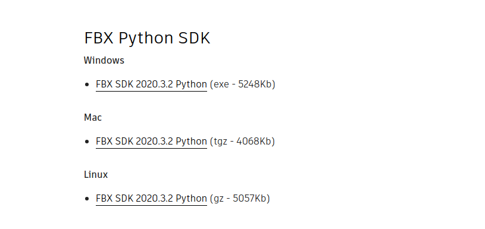
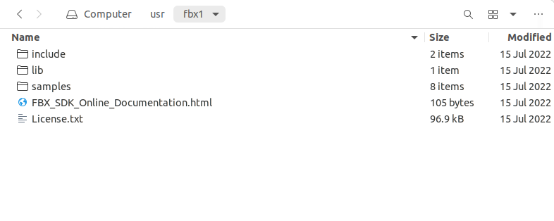
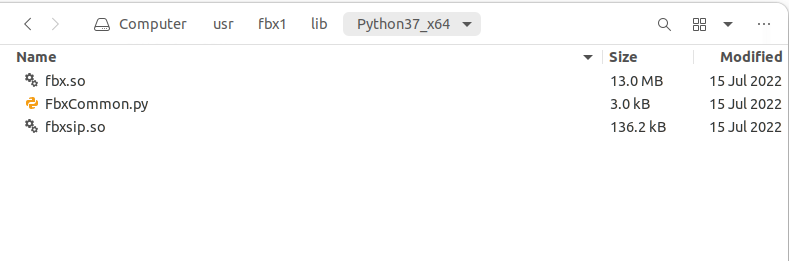

## Xsens to HOTU

[`xsens_fbx_to_hotu_npy.py`](./xsens_fbx_to_hotu_npy.py) provides utilities for converting Xsens motion capture `fbx`
data to the `npy` data used by HOTU digital human in IsaacGym simulator. It contains the joint mapping between Xsens
skeleton and HOTU skeleton, and retargets the motion data from Xsens to HOTU.

### Installation

For running `xsens_fbx_to_hotu_npy.py`, you need to install the `fbx` package in Python 3.7. If you use Rofunc with the
recommended Python 3.8 env, then you need to create another Python 3.7 env for running this script.

```bash
conda create -n rofunc37 python=3.7
conda activate rofunc37

# Install rofunc requirements
cd /path/to/rofunc
pip install -r requirements.txt
pip install -e .
```

Then you can install the `fbx sdk` in the Python 3.7 env:

1. Download the `fbx sdk` from
   the [Autodesk website](https://www.autodesk.com/developer-network/platform-technologies/fbx-sdk-2020-3).
   
2. Unzip the downloaded file and install it
    ```bash
    sudo ./fbx_name_you_downloaded /some/path
    ```
3. You will get following files
   
4. Copy the these three files to the `site-packages` folder of the Python 3.7 env you created
   

You can also refer to this [blog](https://zhuanlan.zhihu.com/p/585738703) for the installation of `fbx sdk`.

### Motion Retargeting

After installation, you can run the script with the following command:

```bash
python xsens_fbx_to_hotu_npy.py --fbx_file <path_to_fbx_file>
```

Or you can run the script with the following command to convert all the `fbx` files in a folder:

```bash
python xsens_fbx_to_hotu_npy.py --fbx_folder <path_to_fbx_folder>
```